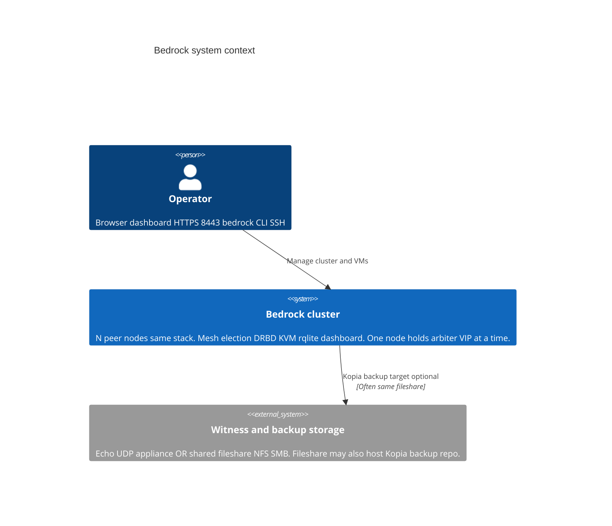
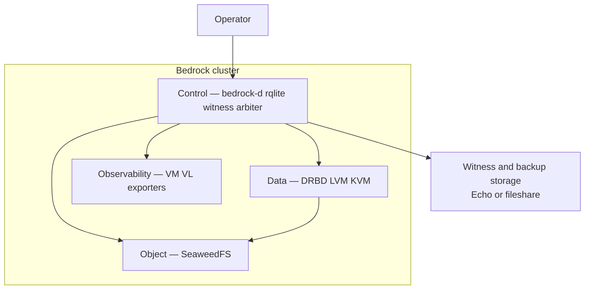
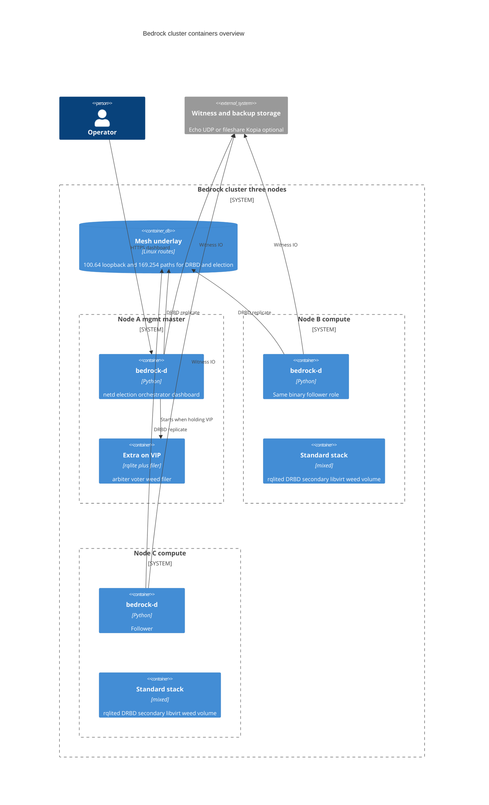
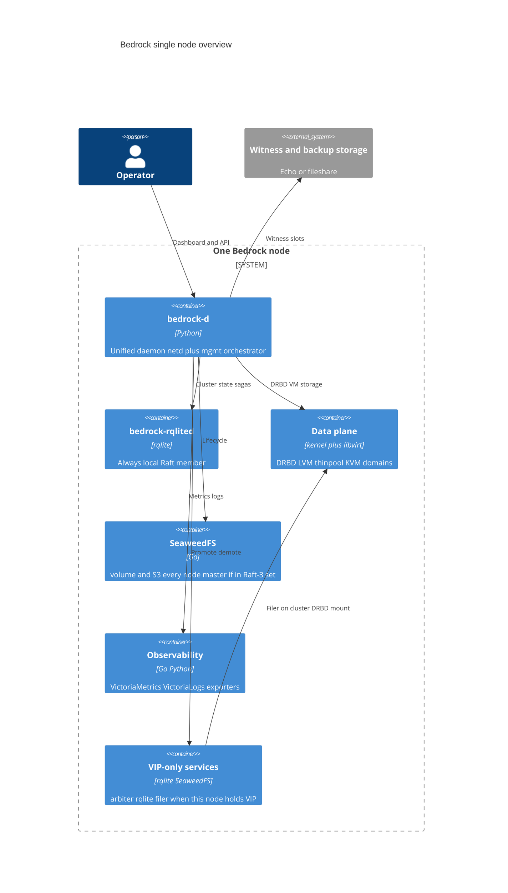
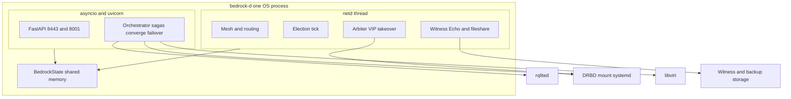
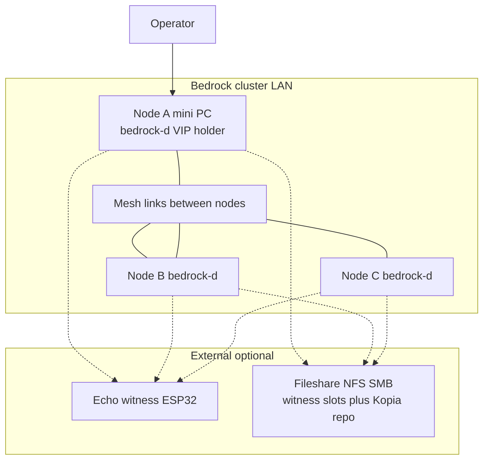

# Bedrock — C4 architecture (draft)

System and **container** levels only. Component-level (`bedrock-d` modules) is a
follow-up.

## Is Bedrock one system or several?

**One software system** — the cluster platform on each node. No external control
plane; whichever node holds the arbiter VIP acts as mgmt master.

| Layer inside Bedrock | Main runtime |
|----------------------|--------------|
| Control & orchestration | `bedrock-d`, `rqlited`, witness protocol |
| Block replication | DRBD, LVM thinpool |
| Compute | KVM / libvirt |
| Object store | SeaweedFS |
| Observability | VictoriaMetrics, VictoriaLogs, exporters |

**Outside Bedrock:** operator, guest VMs (workloads), witness/backup storage
(Echo appliance or shared fileshare — see below).

---

## Level 1 — System context

Overview: operator → Bedrock cluster; optional external store for quorum +
backups.

### Witness backends (detail)

Configured in rqlite `witnesses` — one or more entries, mixed backends allowed:

| Backend | What it is | Quorum role |
|---------|------------|-------------|
| **Echo** | BedRock Echo on UDP 12321 — encrypted slot per node | Tie-break vote when node votes alone are tied |
| **Fileshare** | Same directory mounted at the same path on every node — `slot-NN.bin` files | Same slot protocol, disk-backed instead of UDP |

A **fileshare used for witness slots** is often the same NFS/SMB (or object mount)
already used as a **Kopia `kopia-fs` backup target** — two roles, one share. Echo
is separate hardware; it does not hold backup data.

See [`actions/witness-manage.md`](actions/witness-manage.md) and
[`actions/backup-target-set.md`](actions/backup-target-set.md).

### Logical layers (same product — not separate systems)

---

## Level 2 — Cluster overview

Typical **3-node** cluster. Every node runs `bedrock-d` + `rqlited`; only the
mgmt master runs arbiter rqlite + filer on the VIP. **No parentheses in diagram
labels** — Mermaid C4 parser is picky.

**Every node also runs** (collapsed in diagram): `bedrock-rqlited`, DRBD
resources, libvirt, weed volume + S3, VictoriaMetrics/Logs, exporters. See
[`architecture.md`](architecture.md) port list.

---

## Level 2 — Single node overview

Same **node image** everywhere; master-only pieces start when netd promotes
this host to arbiter.

CLI (`bedrock`) is a loopback HTTP client to `127.0.0.1:8001` — not a container.

---

## Level 3 preview — inside bedrock-d

Not formal C4 yet; shows how one process splits.

---

## Deployment sketch

---

## Finetuning notes

- **L1** — kept to three boxes plus operator so Mermaid layout stays readable.
- **Witness** — Echo and fileshare are one external *role* (quorum store); fileshare
  often doubles as Kopia backup storage.
- **L2 cluster** — collapsed per-node services; expand into separate containers
  when documenting ports or failover paths.
- **Cockpit** — optional host UI, out of scope for these diagrams.
- **N equals 1** — solo rqlite, VIP on loopback, no cluster DRBD until promote.

---

## References

- [`architecture.md`](architecture.md)
- [`daemon-unification.md`](daemon-unification.md)
- [`storage-architecture.md`](storage-architecture.md)
- [`cluster-quorum-spec.md`](cluster-quorum-spec.md)
- [`actions/witness-manage.md`](actions/witness-manage.md)
- [`actions/backup-target-set.md`](actions/backup-target-set.md)
