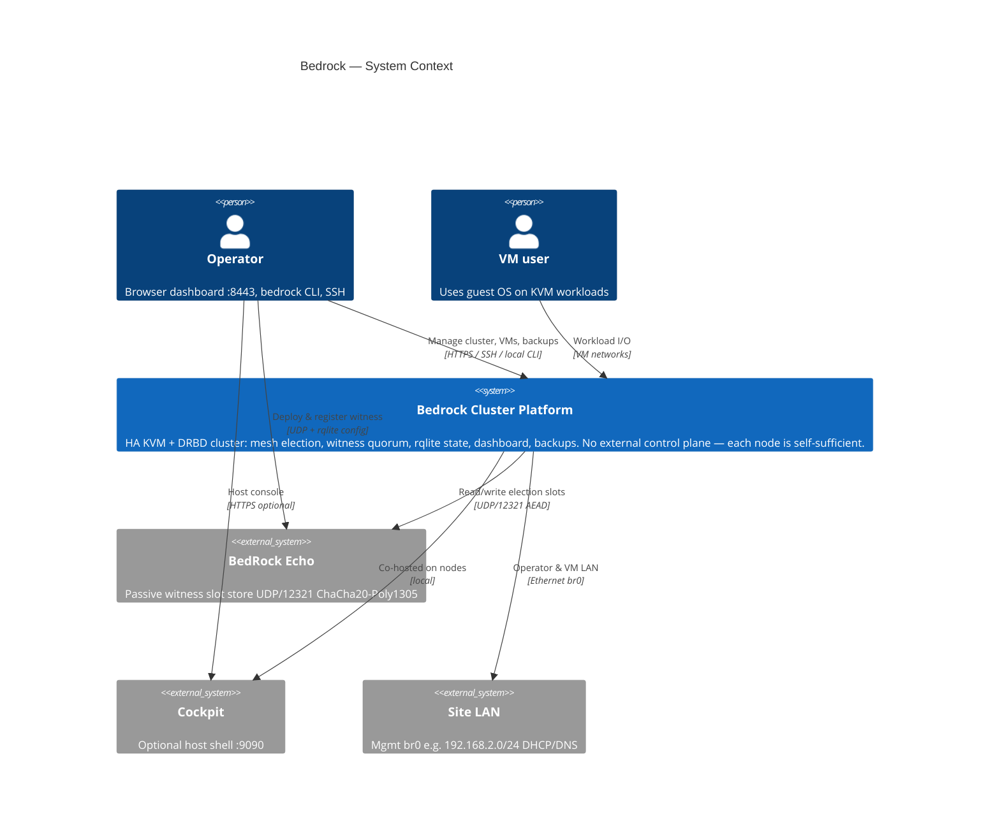
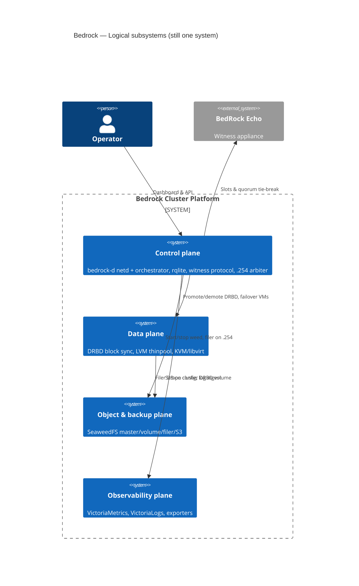
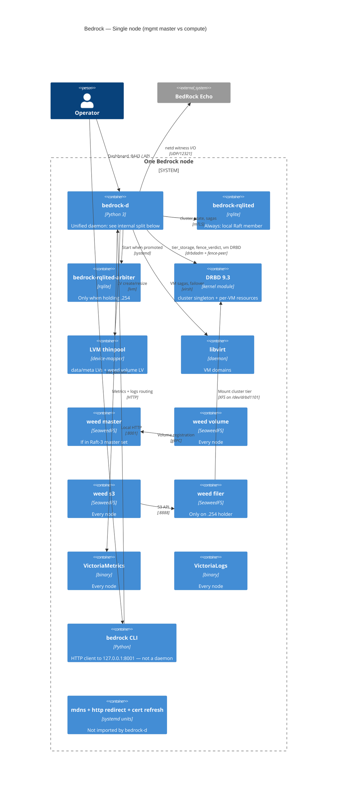
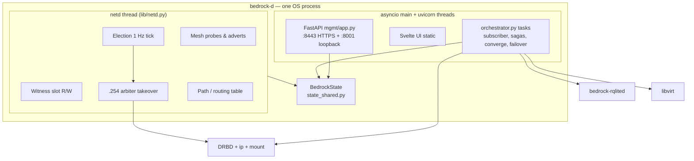
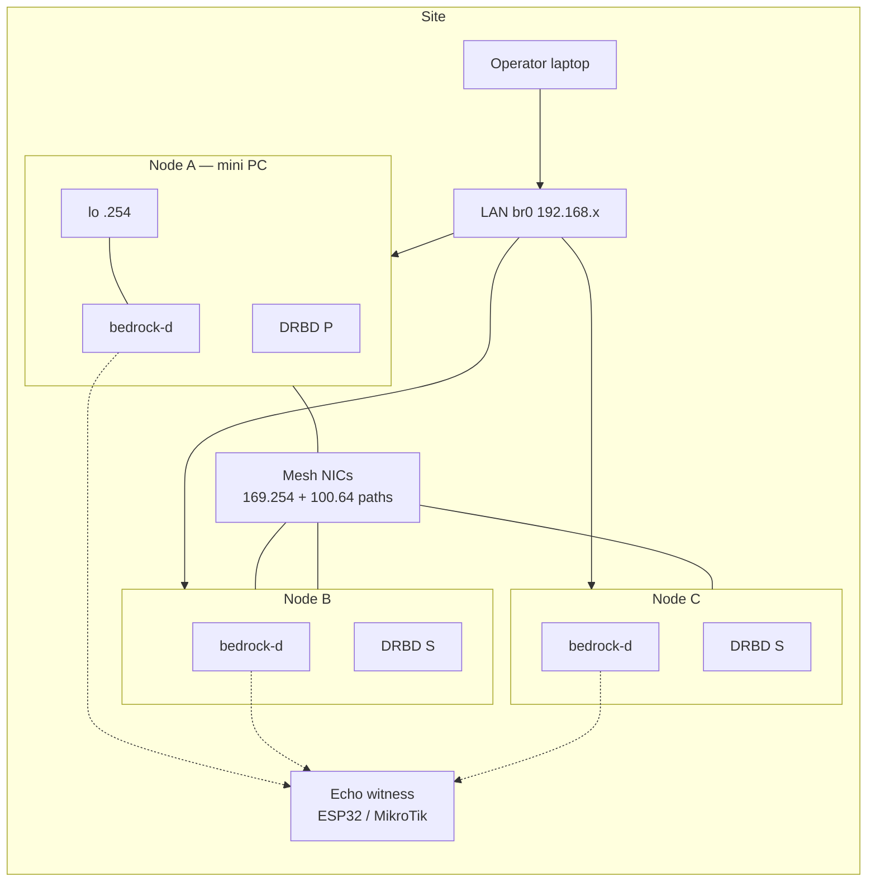

# Bedrock — C4 architecture (draft)

First-pass C4 diagrams for finetuning. **System** and **container** levels only;
component-level (`bedrock-d` internals) is a follow-up.

## Is Bedrock one system or several?

**Recommendation: treat Bedrock as one software system** — the *cluster platform*
that operators install on each node. There is no separate control-plane appliance;
every node runs the same stack, and whichever node holds `.254` acts as the
active mgmt host.

What *looks* like multiple systems are really **layers inside one product**:

| Layer | Runtime | Shared with other layers? |
|-------|---------|---------------------------|
| **Control & orchestration** | `bedrock-d` (netd + mgmt/orchestrator), `rqlited` | Same nodes, same repo (`lib/`, `mgmt/`, `bedrock_d/`) |
| **Block replication** | DRBD 9.3 (kernel) | Driven by `bedrock-d`; config from rqlite |
| **Compute** | KVM / libvirt | Orchestrated by `bedrock-d` sagas |
| **Object / backup store** | SeaweedFS (`weed-*`) | Started by `bedrock-d`; filer on DRBD singleton |
| **Observability** | VictoriaMetrics, VictoriaLogs, agents | Started by `bedrock-d`; scrape config from rqlite |

**Outside Bedrock** (separate software systems):

- **BedRock Echo** — passive witness K/V (UDP/12321, AEAD); ESP32 or small container
- **Operator browser / SSH client** — human
- **Guest VMs** — customer workloads
- **Cockpit** — optional host console (not Bedrock-specific)

**Source-code layout ≠ runtime systems.** `installer/`, `lib/`, `mgmt/`, and
`bedrock_d/` are modules of one daemon + one CLI, not separate deployables.

Use a **second diagram** (below) only when you need to talk about *logical
subsystems* for design reviews — still one product boundary.

---

## Level 1 — System context

Who touches Bedrock, and what sits outside the cluster.



### Logical subsystems (same product boundary)

When discussing ownership or failure domains, these are **containers inside
Bedrock**, not separate products:



---

## Level 2 — Container diagram (cluster)

Major **processes / deployable units** across a typical 3-node cluster. Lines
show primary control or data flow (not every port).

```mermaid
C4Container
    title Bedrock — Cluster containers (N=3 example)

    Person(operator, "Operator")

    System_Boundary(lan, "Site LAN") {
        Person(operator)
    }

    System_Boundary(node1, "Node 1 — current mgmt master (.254)") {
        Container(bd1, "bedrock-d", "Python", "netd thread + FastAPI mgmt + orchestrator sagas")
        Container(rql1, "bedrock-rqlited", "rqlite", "Per-node Raft voter :4001/:4002")
        Container(rqla, "bedrock-rqlited-arbiter", "rqlite", "Extra voter on .254 :4011/:4012")
        Container(drbd1, "DRBD cluster + VM resources", "kernel drbd9", "Primary for cluster singleton + VM primaries")
        Container(kvm1, "libvirt / KVM", "QEMU/KVM", "Runs VMs on this node")
        Container(weed_m, "weed master", "SeaweedFS", "Raft-3 subset (lowest loopback octets)")
        Container(weed_v1, "weed volume + S3", "SeaweedFS", "Local volume LV; S3 gateway")
        Container(weed_f, "weed filer", "SeaweedFS", "On .254; leveldb3 on cluster DRBD mount")
        Container(vm1, "VictoriaMetrics + vmagent", "Go", ":8428 metrics; remote write fan-out")
        Container(vl1, "VictoriaLogs + vlagent", "Go", ":9428 logs; syslog :5140")
        Container(exp1, "node_exporter + vm_exporter", "Prometheus/Python", ":9100 / :9177")
        Container(ui1, "Mgmt UI", "Svelte static", "Served by bedrock-d :8443")
    }

    System_Boundary(node2, "Node 2 — compute") {
        Container(bd2, "bedrock-d", "Python", "Follower; same code path as node 1")
        Container(rql2, "bedrock-rqlited", "rqlite", "Raft peer")
        Container(drbd2, "DRBD", "kernel", "Secondary replicas")
        Container(kvm2, "libvirt / KVM", "QEMU/KVM", "VMs when scheduled here")
        Container(weed_v2, "weed volume + S3", "SeaweedFS", "Local volumes")
        Container(obs2, "VM + VL + exporters", "Go/Python", "Same pattern as node 1")
    }

    System_Boundary(node3, "Node 3 — compute") {
        Container(bd3, "bedrock-d", "Python", "Follower")
        Container(rql3, "bedrock-rqlited", "rqlite", "Raft peer")
        Container(drbd3, "DRBD", "kernel", "Secondary replicas")
        Container(kvm3, "libvirt / KVM", "QEMU/KVM", "")
        Container(weed_v3, "weed volume + S3", "SeaweedFS", "")
        Container(obs3, "Observability stack", "Go/Python", "")
    }

    System_Boundary(mesh, "bedrock-net mesh underlay") {
        ContainerDb(mesh_note, "100.64/10 loopback + 169.254 link-local paths", "Linux routing", "DRBD multi-path; election UDP; witness-independent liveness")
    }

    System_Ext(echo, "BedRock Echo", "UDP/12321 witness slots")

    Rel(operator, ui1, "HTTPS dashboard", ":8443")
    Rel(operator, bd1, "bedrock CLI", "127.0.0.1:8001 on any node")

    Rel(bd1, rql1, "Read/write cluster state", "mTLS :4001")
    Rel(bd2, rql2, "Raft reads/writes", "mTLS")
    Rel(bd3, rql3, "Raft reads/writes", "mTLS")
    Rel(rqla, rql1, "Arbiter voter joins Raft", ":4012")

    Rel(bd1, echo, "Witness slots", "UDP AEAD")
    Rel(bd2, echo, "Witness slots", "UDP")
    Rel(bd3, echo, "Witness slots", "UDP")

    Rel(bd1, drbd1, "drbdadm, fence-peer handler", "netlink + shell")
    Rel(bd2, drbd2, "Converge role", "")
    Rel(bd3, drbd3, "Converge role", "")

    Rel(drbd1, mesh_note, "Replication", ":7701+")
    Rel(drbd2, mesh_note, "Replication", "")
    Rel(drbd3, mesh_note, "Replication", "")

    Rel(bd1, kvm1, "virsh sagas", "libvirt API")
    Rel(bd2, kvm2, "VM lifecycle", "")
    Rel(bd3, kvm3, "VM lifecycle", "")

    Rel(weed_f, drbd1, "Filer metadata mount", "/var/lib/bedrock/cluster")
    Rel(weed_v1, weed_m, "Register volumes", ":9333")
    Rel(weed_v2, weed_m, "", "")
    Rel(weed_v3, weed_m, "", "")

    Rel(exp1, vm1, "Scrape / remote write", ":8428")
    Rel(bd1, vm1, "Push logs", "HTTP + WS")
```

### Role notes (finetune here)

- **`.254/32` on `lo`** — moves with arbiter; hosts filer, arbiter rqlite, mgmt URL
- **`bedrock-d` starts** rqlited-arbiter, weed-*, VM/DRBD resources once role is known
- **Mgmt master is not a separate install** — same `bedrock-d` binary; netd election + takeover protocol picks the host
- **N=1** — solo rqlite, no DRBD cluster tier until promote; `.254` still bound locally

---

## Level 2 — Container diagram (single node)

Two variants of the same node image: **mgmt master** vs **compute follower**.
Only one node holds the right column at a time.



### Inside `bedrock-d` (preview for Level 3 — not formal C4 yet)



---

## Deployment sketch (physical)

How the same containers map to hardware — useful next to C4 container view.



---

## Open questions for finetuning

1. **System boundary** — Keep one "Bedrock Cluster Platform" box, or split
   "Bedrock Control" vs "Bedrock Storage" for stakeholder diagrams?
2. **SeaweedFS** — Show as one container "SeaweedFS" or four (`master`/`volume`/`filer`/`s3`)?
3. **Observability** — One container "Observability stack" per node vs VM/VL/agents separate?
4. **Cockpit / node_exporter** — In scope for Bedrock C4 or explicitly external?
5. **Component level** — Next pass: `bedrock-d` modules (`cluster_arbiter`, `fence_verdict`,
   `tier_storage`, saga engine) and mgmt routers.
6. **Testbed** — 4th rqlite-only node (not in DRBD `cluster.res`) is a test artifact;
   production diagrams assume N DRBD peers = min(N, 3) for cluster tier.

---

## References

- [`architecture.md`](architecture.md) — prose overview
- [`daemon-unification.md`](daemon-unification.md) — `bedrock-d` internals
- [`storage-architecture.md`](storage-architecture.md) — DRBD + SeaweedFS layout
- [`cluster-quorum-spec.md`](cluster-quorum-spec.md) — witness + arbiter
- [`01-rqlite-state-store.md`](01-rqlite-state-store.md) — rqlite topology at N=1/2/3+
