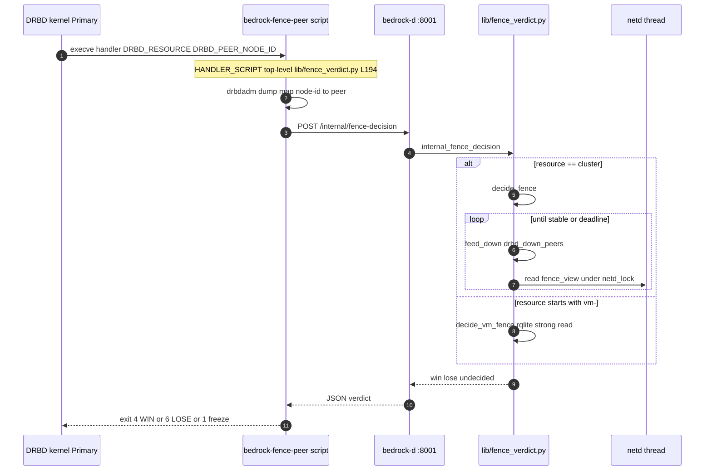
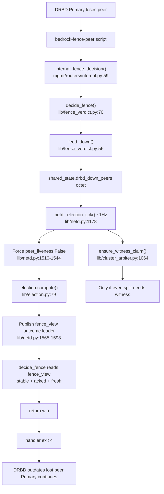
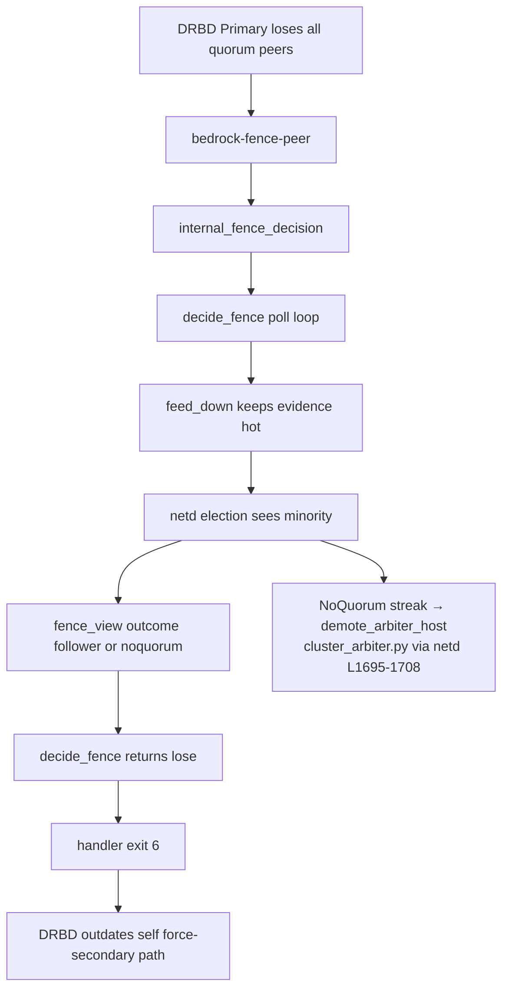
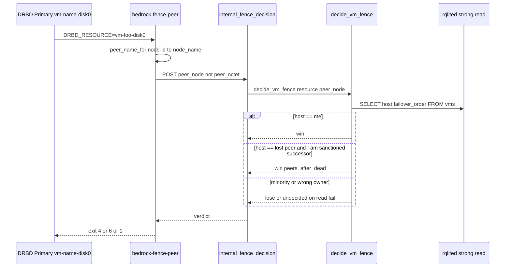
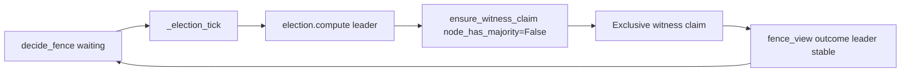
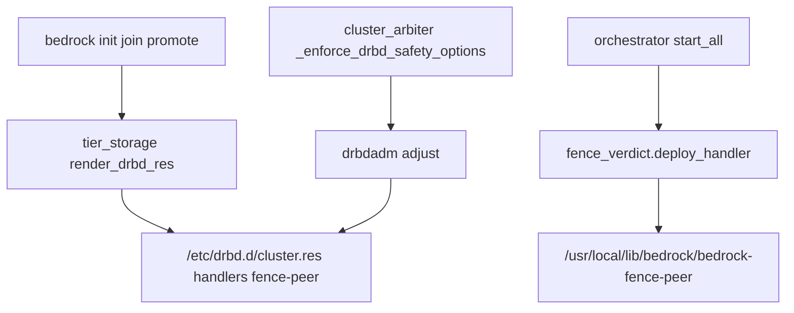

# Bedrock — scenario action diagrams

**Category:** runtime call flows (complements [`c4-architecture.md`](c4-architecture.md)
structure diagrams).

Each scenario lists the **first Bedrock code that runs**, then the full path with
`file:function` (or `file:line` for the deployed handler script). Line numbers are
approximate to `master` — use your editor's symbol search if they drift.

---

## DRBD peer loss — where Bedrock starts

DRBD does **not** import Bedrock. On a **Primary** that loses a replication peer,
the kernel runs a **usermode helper** configured in the resource `.res` file.

### Kernel → handler (not Bedrock Python yet)

| Step | Where | What |
|------|--------|------|
| 1 | DRBD kernel (`conn_disconnect` → `conn_try_outdate_peer_async`) | Primary notices peer gone (ping-int ~5 s on idle link) |
| 2 | DRBD kernel (`drbd_maybe_khelper` → `call_usermodehelper`, `UMH_WAIT_PROC`) | Spawns handler, **blocks** until exit code |
| 3 | `/etc/drbd.d/*.res` | `handlers { fence-peer "/usr/local/lib/bedrock/bedrock-fence-peer"; }` |
| 4 | Env vars set by DRBD | `DRBD_RESOURCE`, `DRBD_PEER_NODE_ID` |

`.res` is rendered by Bedrock at promote/join time:

- **Cluster singleton:** `lib/tier_storage.py:render_drbd_res()` — `fencing resource-only` + handler path (~L1029–L1035)
- **Per-VM disk:** `lib/tier_storage.py` VM path (~L1274–L1277) and `bedrock_d/vm/drbd_config.py`

Handler binary is deployed by:

- `lib/fence_verdict.py:deploy_handler()` — writes `HANDLER_SCRIPT` to `/usr/local/lib/bedrock/bedrock-fence-peer`
- Called from `mgmt/orchestrator.py:start_all()` (~L1468) on every node boot, and
  `lib/cluster_arbiter.py:_enforce_drbd_safety_options()` (~L310) on arbiter path

### First Bedrock code executed

**On disk:** `/usr/local/lib/bedrock/bedrock-fence-peer` — a **standalone** Python
script (source of truth: `lib/fence_verdict.py` `HANDLER_SCRIPT`, ~L194–L307).
It has **no** `import lib.*`; it only uses stdlib + `drbdadm dump`.

**First lines that run** (top-level, in order):

1. Read `DRBD_RESOURCE` / `DRBD_PEER_NODE_ID` from environ (~L213–L214 in `HANDLER_SCRIPT`)
2. `peer_octet_for()` or `peer_name_for()` — map node-id via `drbdadm dump` (~L218–L262)
3. `urllib.request.urlopen` POST to `http://127.0.0.1:8001/internal/fence-decision` (~L287–L292)
4. Map JSON `verdict` → `sys.exit(4|6|1)` (~L298–L306)

**First Bedrock library / daemon code:** FastAPI route
`mgmt/routers/internal.py:internal_fence_decision()` (~L59), running inside the
**already-running** `bedrock-d` process (uvicorn threadpool).

### Exit codes (DRBD acts on these)

| Handler exit | Meaning | DRBD effect |
|--------------|---------|-------------|
| **4** | WIN — outdate **peer** | Primary may continue; peer marked outdated |
| **6** | LOSE — outdate **self** | This node yields; stays frozen/suspended |
| **1** | undecided / error | IO stays frozen (safe default) |

See `docs/drbd-fence-peer-arbiter-design.md` § exit-code table.

---

## Scenario A — `cluster` resource, majority side wins

**Situation:** This node is DRBD **Primary** for `cluster`. It loses contact with
one **Secondary** peer but still has quorum (majority of DRBD peers reachable).
Netd election → **leader**.

**Review path (cluster / WIN):**

| # | File | Symbol | Role |
|---|------|--------|------|
| 0 | `lib/fence_verdict.py` | `HANDLER_SCRIPT` L268–275 | Script entry: map peer, log `asking bedrock-d` |
| 1 | `mgmt/routers/internal.py` | `internal_fence_decision` L84–88 | Branch `resource == cluster` → `decide_fence` |
| 2 | `lib/fence_verdict.py` | `feed_down` L56 | Stamp `drbd_down_peers[octet]` |
| 3 | `lib/netd.py` | `_election_tick` L1510–1544 | Consume `drbd_down_peers`, force liveness false |
| 4 | `lib/election.py` | `compute` L79 | Tally votes + witnesses → outcome |
| 5 | `lib/netd.py` | `_election_tick` L1565–1593 | Publish `fence_view` |
| 6 | `lib/fence_verdict.py` | `decide_fence` L88–104 | Poll until `outcome==leader` stable → `"win"` |
| 7 | `lib/fence_verdict.py` | `HANDLER_SCRIPT` L298–300 | `sys.exit(4)` |

**Parallel track (not fence-peer):** a **Secondary** on the winning partition that
becomes election **leader** promotes via `netd.py:_election_tick` L1720–1736 →
`cluster_arbiter.py:promote_to_arbiter_host` L531 (`.254`, filer, arbiter rqlite).
That path does **not** go through `bedrock-fence-peer`.

---

## Scenario B — `cluster` resource, minority Primary loses

**Situation:** Isolated Primary (or minority partition). Election → **follower**
or **noquorum**. Fence-peer must **LOSE** so DRBD outdates self and does not mint
a new UUID.

**Review path (cluster / LOSE):**

| # | File | Symbol | Role |
|---|------|--------|------|
| 1–5 | (same as Scenario A) | | Evidence + election |
| 6 | `lib/fence_verdict.py` | `decide_fence` L103–104 | `outcome in (follower, noquorum)` → `"lose"` |
| 7 | `lib/fence_verdict.py` | `HANDLER_SCRIPT` L301–303 | `sys.exit(6)` |
| 8 | `lib/netd.py` | `_election_tick` L1688–1708 | Optional: `demote_arbiter_host()` after NoQuorum streak |

**Timing:** `decide_fence` waits up to `DECIDE_DEADLINE_S` (18 s) for stable
`fence_view`; `DECIDE_STABLE_S` = 2.5 s hold. See `docs/explainers/03-timing-and-races.md`.

---

## Scenario C — `cluster` resource, undecided freeze

**Situation:** netd not ticking, deadline exceeded, or `fence_view` never becomes
fresh+acked+stable → safe freeze.

| Condition | `decide_fence` returns | Handler exit |
|-----------|------------------------|--------------|
| `now >= deadline` | `"undecided"` | 1 |
| HTTP failure / no bedrock-d | (handler never gets JSON) | 1 |
| `request.app.state.bedrock` missing | `"undecided"` from API | 1 |
| `outcome` empty or not leader/follower/noquorum | keep polling → deadline | 1 |

**Code:** `lib/fence_verdict.py:decide_fence` L105–106, `HANDLER_SCRIPT` L293–306.

---

## Scenario D — per-VM disk `vm-*` resource

**Situation:** Pet/vipet VM disk Primary loses peer. Same handler script; different
API branch and authority (**rqlite**, not netd election).

**Review path (VM disk):**

| # | File | Symbol | Role |
|---|------|--------|------|
| 0 | `lib/fence_verdict.py` | `HANDLER_SCRIPT` L276–282 | `vm-*` branch, `peer_node` in payload |
| 1 | `mgmt/routers/internal.py` | `internal_fence_decision` L89–90 | `decide_vm_fence` |
| 2 | `lib/fence_verdict.py` | `decide_vm_fence` L126 | Entry |
| 3 | `lib/fence_verdict.py` | `vm_name_for_resource` L110 | Parse `vm-<name>-disk<N>` |
| 4 | `lib/fence_verdict.py` | `decide_vm_fence` L168–172 | `rqlite_client.query_one(..., level="strong")` |
| 5 | `bedrock_d/vm/failover.py` | `peers_after_dead` | Sanctioned takeover when `host == peer_node` |
| 6 | `lib/fence_verdict.py` | `decide_vm_fence` L178–188 | win / lose |

**Note:** VM failover orchestration also runs in
`bedrock_d/orchestrator/vm_failover.py` (`takeover_after_peer_down_task`, ~35 s
peer-down threshold). Fence-peer answers the **synchronous** DRBD question during
`drbdadm primary`; the orchestrator handles longer-horizon takeover.

---

## Scenario E — witness claim on even split (cluster only)

Not a separate DRBD call — runs inside netd while `decide_fence` waits.

When `election.compute` returns **leader** but node votes alone do **not** reach
majority, the witness is **pivotal**:

| File | Symbol | Role |
|------|--------|------|
| `lib/netd.py` | `_election_tick` L1744–1748 | Calls `ensure_witness_claim` on leader branch |
| `lib/cluster_arbiter.py` | `ensure_witness_claim` L1064 | Claim or release witness bit |
| `lib/witness.py` | slot read/write | Echo UDP or fileshare `slot-NN.bin` |

---

## Scenario F — configuration and deploy (before any peer loss)

Nothing runs until DRBD has the handler wired:

| File | Symbol |
|------|--------|
| `lib/tier_storage.py` | `render_drbd_res` ~L1029–1035 |
| `lib/fence_verdict.py` | `deploy_handler` L313 |
| `mgmt/orchestrator.py` | `start_all` ~L1468 |
| `lib/cluster_arbiter.py` | `_enforce_drbd_safety_options` ~L302–325 |

---

## Quick reference — two authorities

| DRBD resource | Bedrock authority | Decision function | Endpoint branch |
|---------------|-------------------|-------------------|-----------------|
| `cluster` | netd election + witness | `decide_fence` | `internal_fence_decision` L84–88 |
| `vm-<name>-disk<N>` | rqlite `vms` row | `decide_vm_fence` | `internal_fence_decision` L89–90 |

---

## Related docs

- [`drbd-fence-peer-arbiter-design.md`](drbd-fence-peer-arbiter-design.md) — kernel exit codes, design rationale
- [`explainers/01-drbd-perspective.md`](explainers/01-drbd-perspective.md) — DRBD-side timeline
- [`explainers/02-bedrock-perspective.md`](explainers/02-bedrock-perspective.md) — bedrock-d-side timeline
- [`explainers/03-timing-and-races.md`](explainers/03-timing-and-races.md) — seconds budget
- [`c4-architecture.md`](c4-architecture.md) — system / container diagrams
