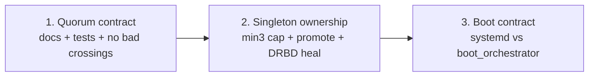

# Bedrock — three biggest architecture fixes (draft)

**Status:** draft recommendations — ordered by how hard they block the
product goals in [`BEDROCK.md`](../../BEDROCK.md) and the README:
**2-node HA as first-class**, **crash-resumable orchestration**, and a
**trustworthy cluster singleton** (arbiter + SeaweedFS filer + S3 IAM).

This is not a backlog of polish items. It is the three structural moves that
most improve the path from “works in a lab” to “MSP can leave two boxes + a
witness unattended.”

Evidence draws from live RCA
[`ARCHITECTURE-FINDINGS-2026-05-29.md`](../../ARCHITECTURE-FINDINGS-2026-05-29.md),
the netd/cluster split docs, and the DRBD quorum lessons log.

---

## Goals these fixes serve

| Goal | Why it matters |
|------|----------------|
| **Two boxes + witness beats Proxmox-on-two-nodes** | Positioning lives or dies on safe failover when N=2 |
| **Orchestrator crash / power loss ⇒ freeze, then resume** | Core principle: sagas durable in rqlite; boot picks up |
| **Per-VM blast radius + sticky mgmt/S3 on VIP** | Cluster singleton must fail over cleanly or the product story collapses |

---

## Fix 1 — Make 2-node HA a single coherent control-plane contract

### Problem

2-node HA is the marketing differentiator, but the **control-plane story is
still fragmented across docs and code eras**:

- Runtime is correct in shape: `bedrock-d` runs a **netd** thread (mesh) and a
  **cluster** thread (election / witness / arbiter) sharing `BedrockState`
  (`installer/bedrock-d`).
- Product docs and older architecture pages still describe “one netd thread
  owns mesh + election + witness + VIP” (`docs/daemon-unification.md`,
  Level 3 in `docs/c4-architecture.md`).
- Quorum / death-oracle semantics (HOSTING bit, claim, self-demote before
  promote) are load-bearing and tested, but the written specs lag the code
  in places (`cluster-quorum-spec.md` vs `witness-death-oracle.md`).
- Deferred “crossings” (`docs/FUTURE_CLUSTER_NETD_CROSSINGS.md`) tempt
  premature re-coupling of mesh reachability into election — exactly how
  the old monolith got timing-fragile.

Operators and contributors cannot reason about failover if there are two
mental models.

### What “done” looks like

1. **One canonical model** published and enforced in code comments:
   - Mesh = reachability / routes only.
   - Cluster = HB + witness + election + VIP.
   - Orchestrator = sagas / converge / backup; never realtime quorum.
2. **Death-oracle + HOSTING** as the documented source of truth for
   “is the master still hosting?” — align `cluster-quorum-spec.md`,
   `state-flow.md`, and arbiter code paths.
3. **Explicit non-goals until reviewed:** do not wire mesh `last_seen` into
   election without a written crossing design (false takeover vs slow
   failover tradeoffs already listed in FUTURE crossings).
4. Refresh daemon-unification / C4 L3 so GitHub readers match process reality
   (the draft [`c4-product-overview.md`](c4-product-overview.md) already
   sketches this).

### Why this is #1

If the 2-node story is unclear or unstable, backup and S3 polish do not
matter — the VMware-refugee buyer never trusts the box. Correctness of
failover *policy* is architecture, not a feature flag.

### Rough work

- Spec freeze + doc alignment (cluster thread ownership).
- Audit `cluster_arbiter` / `cluster_daemon` / fence feeds against the frozen
  model; add scenario tests for N=2 + witness (isolate master, isolate
  follower, witness down, dual power loss).
- Keep mesh rebuild (`docs/future/mesh-daemon-bottom-up-rebuild.md`) **out**
  of this fix — it helps ops clarity later, not quorum correctness now.

---

## Fix 2 — Own the cluster singleton end-to-end (DRBD + promote + heal)

### Problem

Almost every “platform” surface rides one DRBD resource — the **`cluster`
singleton**:

- Arbiter rqlite voter on `.254`
- SeaweedFS filer DB + S3 IAM
- Sticky management endpoint after failover

Live deploy findings called out structural cracks:

| Finding | Impact |
|---------|--------|
| **A-3** — `min(3,N)` replica cap not enforced | At N=4 the singleton went 4-way, sync wedged, **no UpToDate secondary → arbiter cannot fail over**. Marked **⚠ blocks HA**. |
| **A-1** — Dual ownership of promote/mount | `tier_storage` and `cluster_arbiter` both promote/mount; marker papered over races |
| **A-5** — Auto vs operator promote | Two triggers for one transition |
| **L-DRBD** — quorum-lost Primary UUID rotation | Kernel/DRBD behaviour can force full resync / false split-brain; bedrock-d alone cannot paper over it |

Without a healthy UpToDate peer and a single promote owner, **2-node and
3-node failover of mgmt/S3 is fiction**, even if VM DRBD pairs are fine.

### What “done” looks like

1. **Enforce `min(3, N)` membership** on join/leave for the singleton; never
   widen past three peers. Re-validate initial sync and failover on a fresh
   ISO after the cap.
2. **Single owner split:**
   - `tier_storage` / saga: one-time N=1→N=2 setup + data restore only.
   - `cluster_arbiter`: ongoing Primary / `.254` / arbiter services on
     election only.
3. **One promote trigger model** (auto *or* operator — not both).
4. **Heal path:** land or vendor the durable DRBD fix for
   `PRIMARY_LOST_QUORUM` UUID bump (see upstream bug-report tree under
   `docs/bug-reports-upstream/…` and `docs/lessons-log.md`); pair with
   quorum policy Bedrock actually wants (quorum=ALL + known UUID minting
   rules). Idempotent peer-side transitions (A-6) so saga resume cannot
   brick create-md.

### Why this is #2

Backup and dashboard depend on the VIP/filer surviving node loss. Fix 1
decides *who may* take over; Fix 2 makes sure *there is something healthy
to take over*.

### Rough work

- Cap enforcement in join / peer-add paths + regression test at N≥4.
- Refactor promote ownership (delete shared responsibility, keep marker
  only as assert).
- DRBD patch validation in testbed; document operator expectations when
  running stock vs patched kmod.

---

## Fix 3 — Treat boot / power-loss as an architecture contract, not an afterthought

### Problem

Design principle:

> All cluster orchestration goes through rqlite as sagas… Power-loss at any
> step is recoverable: on boot, pick up where the `operation_steps` log says
> we left off.

Live RCA showed the **daemon-unification boot story was incomplete**:

- **RCA #5** — `state.json` rewritten without fsync → 0-byte file → deadlock
  after unclean reboot (fixed for that file).
- **RCA #6** — `bedrock-rqlited` not `WantedBy=multi-user.target` → consensus
  store never returned (fixed for rqlited).
- **A-2** — Same question remains for **weed-\*, obs stack, arbiter, per-VM
  DRBD + domains**: which units systemd must start as foundations vs which
  `boot_orchestrator` must re-arm after quorum.
- **A-7** — fsync audit still open for other `/etc/bedrock` writers.

Until this is explicit, “MSP-grade” power loss is a hope, not a contract.

### What “done” looks like

1. **Written boot matrix** per role (N=1, follower, VIP holder):
   - **systemd foundations** (always): e.g. rqlited, libvirtd, network,
     maybe weed-volume — whatever must exist before bedrock-d can think.
   - **role-aware bring-up** (bedrock-d only after quorum / role known):
     arbiter, filer, VIP bind, VM start order, DRBD primary decisions.
2. **`boot_orchestrator` is the only second-stage starter** — idempotent,
   tested by “kill -9 mid-saga + cold boot” scenarios, not only happy
   `init`/`join`.
3. **Durability audit**: fsync-before-rename (or equivalent) for every
   crash-sensitive local writer under `/etc/bedrock` and critical env
   renders; persistent journald on install images.
4. Align install/ISO units with the matrix so fresh metal matches the lab.

### Why this is #3

Fixes 1–2 assume a node that comes back knows who it is and can resume.
Without Fix 3, every power event reintroduces the “half-up cluster” class
of bugs that burned the May 2026 deploy loop.

### Rough work

- Codify the matrix in `docs/` + assert it in testbed reboot campaigns.
- Extend A-7 audit; bake journald persistence into ISO (already noted as
  install gap).
- Prove saga resume for backup, VM create, and singleton peer join across
  reboot.

---

## What is deliberately not in the top three

These matter, but they are **amplifiers** once the above contracts hold:

| Item | Why deferred here |
|------|-------------------|
| Mesh bottom-up rebuild + event bus | Clarity and velocity; not the HA correctness bottleneck |
| Netd ↔ cluster signal crossings | Useful after the split model is frozen |
| Backup UX / multi-repo polish | Product layer on a stable home-node + target |
| Observability depth | Does not unlock 2-node trust |
| Doc-only cleanup without behaviour change | Enabler for Fix 1, not a substitute |

---

## Suggested sequence

1 before 2: you need a clear election/VIP owner before you harden what that
owner mounts.  
2 before 3: boot bring-up rules depend on knowing which services are
singleton-VIP vs always-local.  
After all three: mesh rebuild and optional crossings become safe
optimizations.

---

## References

- [`BEDROCK.md`](../../BEDROCK.md) — principles and market
- [`ARCHITECTURE-FINDINGS-2026-05-29.md`](../../ARCHITECTURE-FINDINGS-2026-05-29.md) — A-1…A-7, RCA #5/#6
- [`../cluster-quorum-spec.md`](../cluster-quorum-spec.md) — vote math
- [`../witness-death-oracle.md`](../witness-death-oracle.md) — HOSTING / death oracle
- [`../FUTURE_CLUSTER_NETD_CROSSINGS.md`](../FUTURE_CLUSTER_NETD_CROSSINGS.md) — deferred coupling
- [`../future/mesh-daemon-bottom-up-rebuild.md`](../future/mesh-daemon-bottom-up-rebuild.md) — mesh rebuild (not top-3)
- [`../lessons-log.md`](../lessons-log.md) — DRBD UUID / quorum lessons
- [`c4-product-overview.md`](c4-product-overview.md) — companion C4 draft
