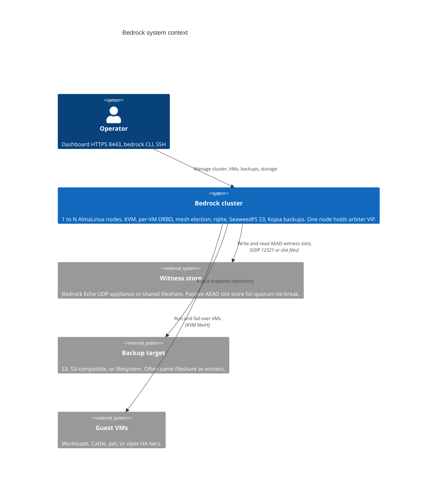
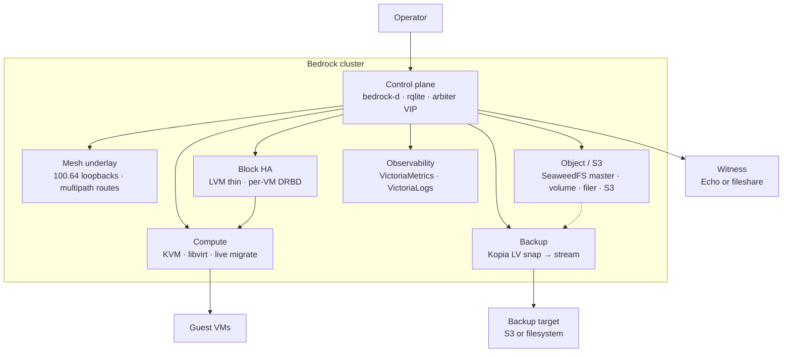
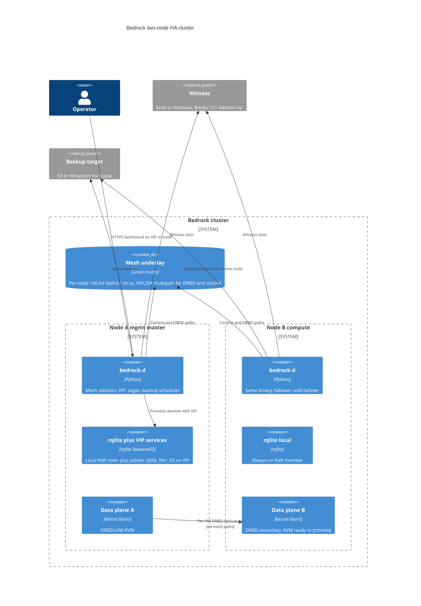
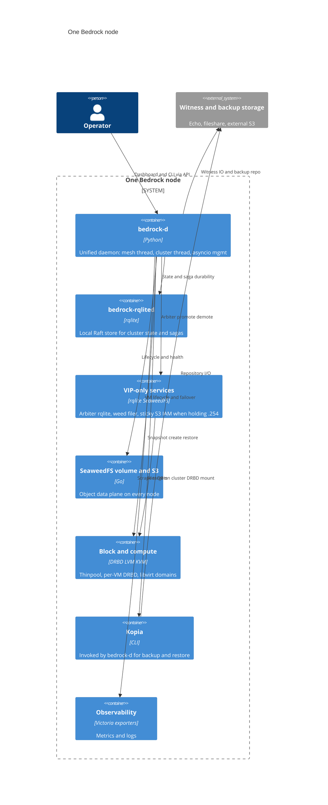
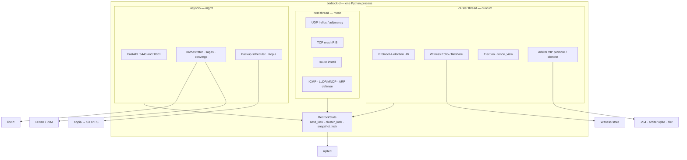
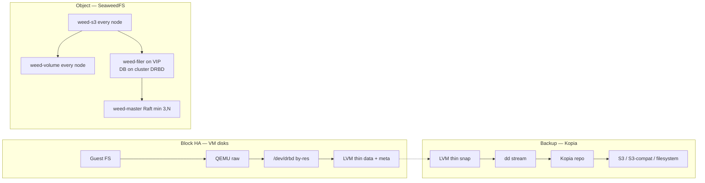
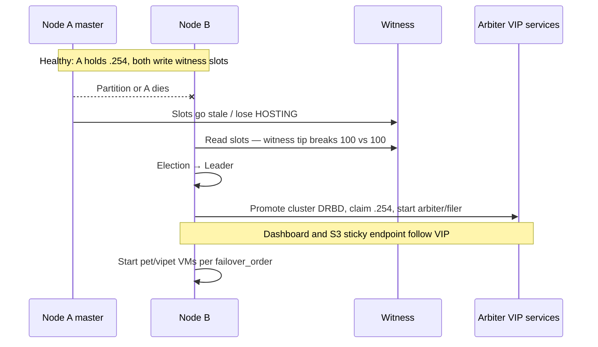

# Bedrock — product C4 overview (draft)

**Status:** draft — product-facing system map for GitHub. Complements the
engineer-oriented [`../c4-architecture.md`](../c4-architecture.md) and
[`../architecture.md`](../architecture.md). Level-3 inside `bedrock-d` here
reflects the **current** netd / cluster thread split.

## Positioning

Bedrock is an **open-source local HA virtualization platform**: AlmaLinux 10
nodes running KVM, per-VM DRBD, live migration, and a built-in dashboard —
without Corosync or a Proxmox-style framework.

It targets **VMware refugees and MSPs** who need:

| Pillar | What first-class means |
|--------|------------------------|
| **1 → N growth** | Start on one box; add a second for HA; scale further |
| **2-node HA** | Two servers + a cheap witness is a supported topology, not an afterthought |
| **Integrated backup** | Kopia into S3 / S3-compatible / filesystem, from the same control plane |
| **Integrated object store** | SeaweedFS S3 on every node; cluster filer on the arbiter VIP |
| **Thin blast radius** | One DRBD resource per VM disk — not one shared storage cluster for all VMs |

---

## Level 1 — System context

Operator manages a Bedrock cluster. External storage is optional but central
to **2-node quorum** (witness) and **durable backups** (often the same share
or an S3 bucket).

### Why the witness is first-class for 2-node HA

Without a third voting node, classic majority quorum leaves two nodes stuck
or split-brained. Bedrock uses **weighted votes** (node = 100, witness = 1)
so a witness is a **pure tie-breaker**: decisive only on an exact even split,
never able to override a node majority. See
[`../cluster-quorum-spec.md`](../cluster-quorum-spec.md).

---

## Level 1b — Product capabilities map

Same system, viewed as capability planes rather than processes.

---

## Level 2 — Cluster containers (2-node HA highlighted)

The **smallest production HA** shape: two compute nodes + one witness.
Three-plus nodes still use the same stack; the witness remains useful but is
less often pivotal.

**On every node (collapsed above):** weed volume + S3 endpoint, exporters,
Victoria stack where configured, libvirt. The **arbiter VIP**
(`100.X.Y.254`) hosts the extra rqlite voter, SeaweedFS filer, and the
operator-facing sticky endpoint after failover.

---

## Level 2 — Single node containers

Identical image on every host. VIP-only services start when this node is
elected / holds the arbiter role.

---

## Level 3 — Inside `bedrock-d` (current)

One OS process, three cooperative loops, shared `BedrockState`. No
file-based IPC for live control-plane decisions.

| Thread | Owns | Must not own |
|--------|------|--------------|
| **netd** | Neighbours, RIB, routes, L2 extras | Election / VIP takeover |
| **cluster** | HB, witness, quorum, arbiter | Route table mutation |
| **asyncio** | API, sagas, backup, calm reconcile | Realtime election timing |

---

## Level 2 — Data planes (backup + S3 + block)

How the three storage stories sit next to each other.

| Plane | Unit of HA | Failure domain |
|-------|------------|----------------|
| VM disk | Per-VM DRBD (pet 2-way / vipet 3-way) | That VM only |
| Cluster singleton | `cluster` DRBD `min(3,N)` | Arbiter + filer + S3 IAM |
| Object data | SeaweedFS collections | Per-collection replica policy |
| Backup | External Kopia repo | Independent of live cluster |

---

## 2-node failover sketch

Safety hinges on: **node-majority always wins**, witness only on exact ties,
and arbiter takeover gated on **exact DRBD current-UUID** match against the
dying master's witness marker — not on "whoever shouts loudest."

---

## What this is deliberately not

- Not an external control plane (no separate "manager appliance" required)
- Not a shared cluster filesystem on the VM disk path
- Not Corosync / Pacemaker / PVE HA manager
- Not Nutanix-scale distributed storage for every byte

---

## Related docs

| Doc | Role |
|-----|------|
| [`../architecture.md`](../architecture.md) | Ports, components, orientation |
| [`../c4-architecture.md`](../c4-architecture.md) | Earlier C4 draft (L3 partially stale) |
| [`../c4-scenarios.md`](../c4-scenarios.md) | Runtime failure flows |
| [`../cluster-quorum-spec.md`](../cluster-quorum-spec.md) | Witness vote math + takeover |
| [`../storage-architecture.md`](../storage-architecture.md) | LVM / DRBD / SeaweedFS |
| [`../snapshots-and-backup.md`](../snapshots-and-backup.md) | Kopia backup design |
| [`../daemon-unification.md`](../daemon-unification.md) | `bedrock-d` process model (update for cluster thread) |
| [`BEDROCK.md`](../../BEDROCK.md) | Product reference + principles |
