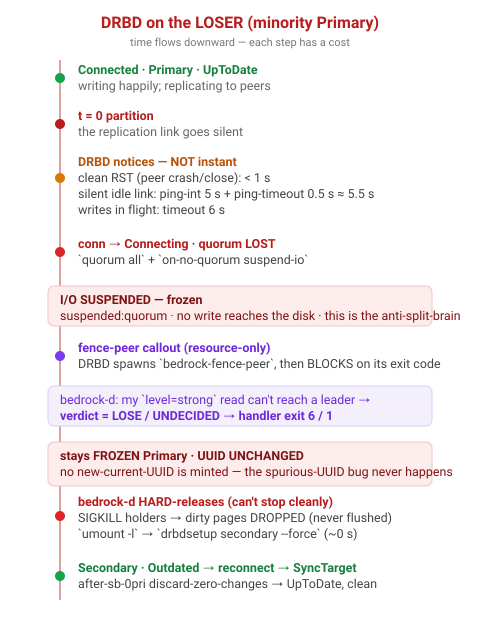
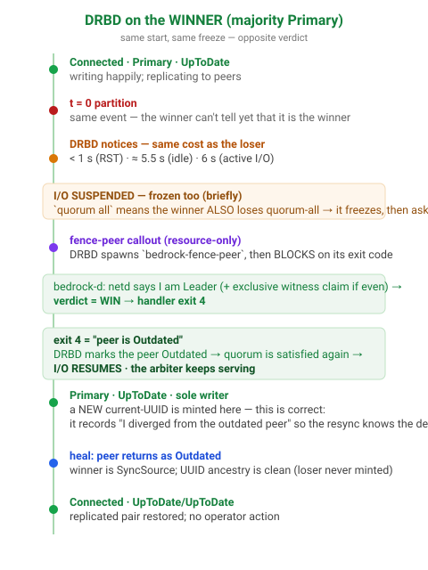

# 01 — The arbiter failover, from DRBD's point of view

> The kernel DRBD driver doesn't know what a "cluster" or a "master" is. It knows one resource
> (`cluster`), a set of peers, a quorum rule, a fencing policy, and one external program it is
> allowed to ask a yes/no question: the **fence-peer handler**. This doc walks the failover
> **once on each side** of a partition, because the two sides run the *same code* and reach
> *opposite* outcomes — and that symmetry is the whole point.

The `cluster` resource is configured (`installer/lib/cluster_arbiter.py`, `installer/lib/tier_storage.py`):

```
options { quorum all; on-no-quorum suspend-io; on-suspended-primary-outdated force-secondary;
          auto-promote no; }
net     { ... ping-int 5; allow-two-primaries no;
          after-sb-0pri discard-zero-changes; after-sb-1pri discard-secondary;
          after-sb-2pri disconnect; fencing resource-only; }
handlers { fence-peer "/usr/local/lib/bedrock/bedrock-fence-peer"; }
```

Four of those lines carry the entire safety argument:

- **`auto-promote no`** — DRBD will *never* make itself Primary on its own (not on a device open,
  a mount, a `blkid` probe). Only bedrock-d's explicit `drbdadm primary` ever promotes. Without
  this, a device-open race during failover is a second, silent path to dual-Primary.
- **`quorum all` + `on-no-quorum suspend-io`** — the moment this node cannot see *all* its peers,
  it **suspends I/O**. Freezing, not erroring, not continuing. Both sides of a partition lose
  "all peers", so **both sides freeze** — that is what guarantees no one is writing while the
  decision is being made.
- **`fencing resource-only` + the fence-peer handler** — when the link drops, DRBD calls
  `bedrock-fence-peer` and **blocks on its exit code** before it will let this node act as a
  lone Primary. This is a *synchronous actuating callout*, exactly like Pacemaker's
  `crm-fence-peer` — not a status file it polls.

## The loser's side



1. **t = 0 — partition.** The link goes silent. Nothing happens yet; DRBD is still Primary,
   still thinks it is UpToDate.
2. **Detection — never instant.** How fast DRBD *notices* depends entirely on how the link died:
   - **clean RST** (peer process crashed, cable pulled with the NIC still up enough to RST,
     `drbdadm down` on the peer): **sub-second**.
   - **silent idle link** (iptables DROP, a switch eating frames, no traffic in flight): DRBD's
     keepalive is the only signal — `ping-int 5 s` + `ping-timeout ≈ 0.5 s` ⇒ **≈ 5.5 s**.
     Bedrock sets `ping-int 5` specifically to bound this (the DRBD default is 10 s).
   - **writes in flight** at the moment of the cut: the data `timeout` (DRBD default **6 s**)
     fires first.
3. **Quorum lost → I/O suspended.** `quorum all` is no longer satisfied, so `on-no-quorum
   suspend-io` freezes every pending and future write. The device shows `suspended:quorum`. **No
   minority write ever reaches the platter.** This is the property everything else depends on.
4. **fence-peer callout.** DRBD runs `bedrock-fence-peer` and waits. The handler asks the local
   bedrock-d "do I win?" (doc 02). On the minority side, bedrock-d's `level=strong` rqlite read
   *cannot reach a leader*, so the answer is **lose / undecided** → the handler exits **6** (lose)
   or **1** (undecided).
5. **Stays frozen — and never mints a UUID.** A non-winning exit means DRBD keeps the I/O frozen.
   Crucially, a frozen quorum-lost Primary **does not generate a new current-UUID**. (Historically
   it could, via the old `resume-io` path — a "sibling" generation that looked like divergence and
   forced a full split-brain resync on heal. The freeze-and-fence design is what kills that bug;
   the testbed asserts the UUID generation is byte-for-byte unchanged across the freeze.)
6. **Hard-release — because it cannot be stopped cleanly.** The device has suspended I/O, so a
   `systemctl stop` of the arbiter rqlite would *flush-and-block forever*, and a normal `umount`
   would *fsync-and-block forever*. So bedrock-d kills instead (doc 02): the held writes are
   **dropped at the kernel level when the process dies, never flushed** — so the minority *still*
   never writes — then `umount -l`, then `drbdsetup secondary --force` (~0 s even while frozen).
7. **Clean heal.** Now Secondary and Outdated, it reconnects as a 0-primary Secondary;
   `after-sb-0pri discard-zero-changes` resolves it to SyncTarget and it resyncs UpToDate. No
   StandAlone tangle, no operator.

## The winner's side



Steps 1–3 are **identical** — the winner also detects the loss after the same ≤5.5 s and, because
`quorum all` also fails for it, **also freezes briefly**. The winner cannot tell from DRBD state
alone that it is the winner; it must ask too.

4. **fence-peer callout → WIN.** On the majority side, bedrock-d's election converges to "I am
   Leader" (claiming the witness if the split is even — doc 02), so the verdict is **win** → the
   handler exits **4**.
5. **exit 4 = "the peer is Outdated".** DRBD records the peer as Outdated. With the peer now
   known-stale, quorum is satisfiable again, so **I/O resumes** and the arbiter keeps serving.
6. **A new UUID is minted here — and that's correct.** As the sole writer that has outdated its
   peer, the winner advances its current-UUID. This is *not* the bug from step 5 of the loser: it
   is the legitimate record of "I diverged from a now-stale peer", and it is exactly what lets the
   returning loser resync just the delta instead of a full copy.
7. **Heal.** The loser returns Outdated; the winner is SyncSource; UUID ancestry is clean (because
   the loser never minted a sibling), so the resync is a clean Outdated → UpToDate, no split-brain.

## Why this is symmetric *and* safe

Both sides freeze first (so nobody writes during the decision), both sides ask the same question,
and **exactly one** gets a "win". The asymmetry is injected entirely by bedrock-d's election +
witness claim — DRBD itself is deliberately dumb about who *should* win. That separation is what
makes the timing analysis in [doc 03](03-timing-and-races.md) tractable: DRBD's only job is to
*freeze fast and ask*, and its worst-case "freeze fast" is the bounded ≤ 6 s above.

→ Continue to **[02 — bedrock-d's view](02-bedrock-perspective.md)** for how that yes/no answer is
actually computed, and how the services are killed and started.
