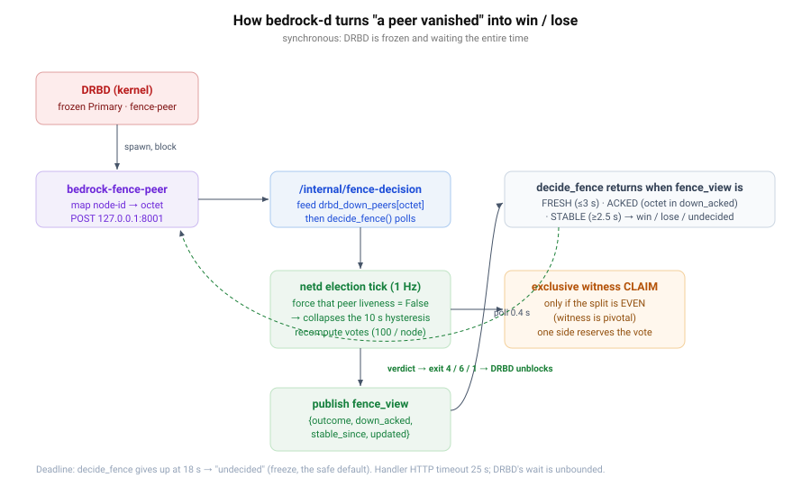
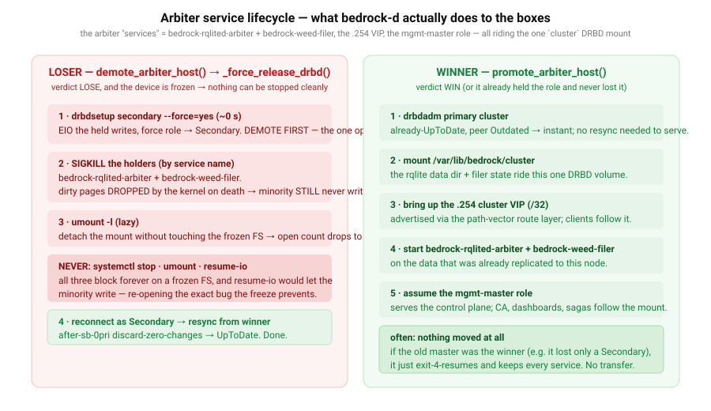

# 02 — The arbiter failover, from bedrock-d's point of view

> DRBD froze and asked a yes/no question (doc 01). This doc is the answer: how `bedrock-d`
> computes **win / lose**, why the answer is a *synchronous call* and not a status file, how the
> **exclusive witness claim** makes an even split safe, and exactly how the arbiter services are
> **killed** on the loser and **started** on the winner.

## Why a call, not a file

The first design materialised the netd election outcome into `/run/bedrock/fence-verdict.json`
and had the handler read it. That is racy by construction: the file is *downstream* of the very
event it arbitrates, so it lags the partition. On the testbed the loser's file still said
"leader" at +3 s — so a minority Primary read "I win" and split-brain happened. Worse, a file
read **cannot perform the exclusive witness claim**, which has to happen *then and there* on the
split.

So the verdict is a **synchronous, actuating call** (`fence_verdict.decide_fence`,
`mgmt/app.py:/internal/fence-decision`). The handler POSTs and **blocks**; DRBD stays frozen the
entire time; bedrock-d does real work and answers with fresh, evidence-accelerated truth.

### Step by step

1. **Handler → endpoint.** `bedrock-fence-peer` maps the lost peer's DRBD node-id to its loopback
   octet (from the local `drbdadm dump` — config only, no kernel calls, safe inside a fence
   callout) and POSTs `{resource, peer_octet}` to `127.0.0.1:8001/internal/fence-decision`
   (loopback only).
2. **Feed DRBD's evidence into the election.** bedrock-d writes `shared_state.drbd_down_peers[octet]
   = now`. This is the key move: **DRBD detected the loss in ≈ 3–6 s, but netd's own mesh liveness
   only declares a peer down after `DOWN_HYSTERESIS_S = 10 s` of silence.** Injecting DRBD's faster,
   authoritative "this peer is gone" lets the next election tick treat that peer as down
   immediately — collapsing the 10 s patience to the next 1 Hz tick. (Evidence older than
   `DRBD_DOWN_TTL_S = 15 s` is discarded so it can't wedge a later, healthy election.)
3. **Election recomputes.** Each reachable active node is worth **100 votes** (`netd.py:1723`),
   the witness is worth a tie-breaking weight. With the lost peer forced to `liveness = False`,
   the tick recomputes whether *this* node's partition holds a majority → `outcome ∈
   {leader, follower, noquorum}`.
4. **Exclusive witness claim — only if the split is even.** If this node's *node-votes alone* meet
   majority, the witness is not pivotal and any prior claim is **released**. If they do **not**
   (a 2-vs-2-style even split where node+witness is what crosses the line), the witness **is**
   pivotal and `cluster_arbiter.ensure_witness_claim` **claims it exclusively**. Exclusivity is the
   safety property: two stale files could both read "leader", but only one side can hold the
   claim, so an even split can never produce two leaders. The arbiter owns this decision alone —
   it is never flipped from a steady-state path.
5. **Publish `fence_view`** `{outcome, down_acked, stable_since, updated}` under the netd lock.
6. **`decide_fence` polls** (`POLL_S = 0.4 s`) until the published view is simultaneously:
   - **FRESH** — `updated` within `FRESH_S = 3 s` (proves netd is actually ticking, not wedged),
   - **ACKED** — our `peer_octet` is in `down_acked` (proves the election *incorporated this exact
     loss*, not some earlier one),
   - **STABLE** — `stable_since` at least `DECIDE_STABLE_S = 2.5 s` ago (proves the partition view
     settled; a simultaneously-isolated master's per-peer evidence arrives over a few ticks, and a
     transient must never decide).

   When all three hold: `leader → win`, `follower/noquorum → lose`. If `DECIDE_DEADLINE_S = 18 s`
   passes first → **undecided**. Undecided maps to handler exit 1 → DRBD stays frozen. **Every
   error path in the whole chain — unreachable endpoint, timeout, exception, no quorum — resolves
   to "stay frozen", the safe default.**

## Killing the loser, starting the winner

A verdict is only half the job. The arbiter is `bedrock-rqlited-arbiter` + `bedrock-weed-filer` +
the `.254` VIP + the mgmt-master role, all riding the single `cluster` DRBD mount. Those have to
be moved — and the loser's cannot be stopped *gracefully*, because its disk is frozen.

### Loser — `demote_arbiter_host()` → `_force_release_drbd()`

A `systemctl stop` of the arbiter rqlite would flush-and-block forever on the suspended device; a
normal `umount` would fsync-and-block forever. And resume-io is forbidden (it would let the
minority write — the bug). So bedrock-d **hard-releases**, in this exact order:

1. **`drbdsetup secondary --force=yes` first (~0 s).** It demotes a frozen Primary *instantly*,
   even with the mount and rqlite still attached, by EIO-ing the held writes. **Demote-first is
   the whole fix** — the old order did `fuser`/`umount` first, which block for tens of seconds on
   the frozen FS, so the demote landed *after* the heal and the loser came back as a Primary →
   1pri/2pri → StandAlone resync-stall.
2. **SIGKILL the holders by service name** (`bedrock-rqlited-arbiter`, `bedrock-weed-filer`). Their
   dirty pages are **dropped by the kernel when the process dies — never flushed** — so the
   minority *still* never writes. (We kill by service name, never `fuser -k -m`: on an EIO'd mount
   `fuser` can fall back to `/` and kill the box.)
3. **`umount -l`** detaches the mount from the namespace without touching the frozen FS.
4. The node is now a clean Secondary; it reconnects and resyncs from the winner.

### Winner — `promote_arbiter_host()`

`drbdadm primary` (instant — already UpToDate, peer Outdated) → mount → bring up the `.254` /32 →
start `bedrock-rqlited-arbiter` + `bedrock-weed-filer` → assume mgmt-master. **Frequently nothing
moves at all:** if the node that won was already the master (it merely lost a Secondary), it just
exit-4-resumes and keeps every service — the "failover" is invisible.

> **Who decides master, who actuates.** netd's election + witness is the *sole writer* of
> `mgmt_master`; `cluster_arbiter` only *actuates* (promote / mount / VIP / services). The arbiter
> never writes the master decision back to rqlite — an earlier "reconcile from arbiter" did, and it
> caused a split-brain race that was removed. Realtime (netd) is the authority; rqlite follows.

→ Continue to **[03 — timing & races](03-timing-and-races.md)** for the second-by-second budget and
the "can there be a race?" walkthrough.
