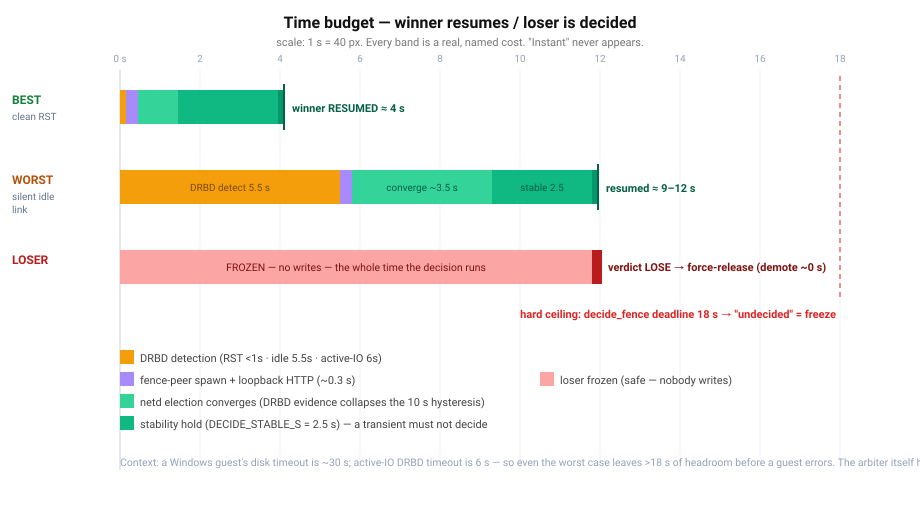
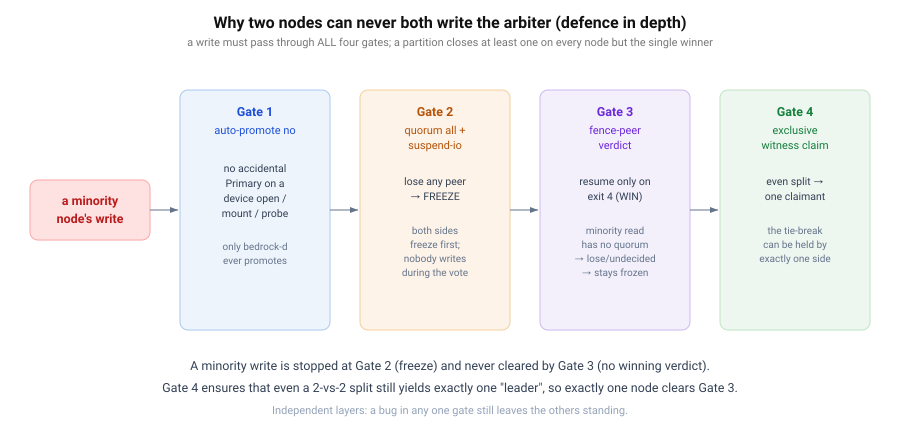

# 03 — Timing & races: second by second, and "can there be a race?"

> This is the doc that earns the others. Distributed systems have no "instant" — so the only way to
> claim the arbiter failover is correct is to **name every cost in seconds** and show that the
> dangerous overlaps cannot happen. We give the best case, the worst case, then walk every race we
> could think of — including the ones that are **still open**, because pretending they don't exist
> would be the real bug.

All numbers are from `installer/lib/{netd,fence_verdict,cluster_arbiter,witness}.py`.

## The full budget

| Phase | Best (clean RST) | Worst (silent idle link) | Set by |
|-------|------------------|--------------------------|--------|
| DRBD notices the peer is gone | **< 1 s** | **≈ 5.5 s** (`ping-int 5` + `ping-timeout 0.5`); **6 s** if writes were in flight (`timeout`) | DRBD `net{}` |
| fence-peer spawn + loopback POST | ~0.1 s | ~0.3 s | OS / FastAPI threadpool |
| netd folds in DRBD's evidence | ≤ 1 s (next 1 Hz tick) | ~3–4 s (a simultaneously-isolated master's per-peer evidence lands over several ticks) | `ELECTION_INTERVAL_S = 1` |
| stability hold before trusting it | **2.5 s** | **2.5 s** | `DECIDE_STABLE_S` |
| **→ winner I/O resumes** | **≈ 4 s** | **≈ 9–12 s** | — |
| hard ceiling → "undecided" (freeze) | — | **18 s** | `DECIDE_DEADLINE_S` |

Two things make the worst case bounded rather than open-ended:

1. **DRBD's evidence collapses netd's patience.** Left alone, netd declares a peer down only after
   `DOWN_HYSTERESIS_S = 10 s` of mesh silence. The fence-peer feeds `drbd_down_peers` in at ≈ 5.5 s,
   and the election forces that peer's `liveness = False` on the *next tick* — so detection is
   gated by DRBD (~5.5 s), not by the 10 s hysteresis.
2. **The stability gate is a floor, not a sum.** `decide_fence` returns the instant the published
   view is FRESH + ACKED + STABLE; it does not wait out the 18 s deadline. 18 s is only the
   give-up-and-freeze ceiling, and freezing is safe.

### Why these specific numbers (the Windows constraint)

`ping-int` is **5 s** by deliberate choice. A Windows guest's default disk timeout is ~30 s; DRBD's
active-I/O `timeout` is 6 s. So a guest's write freezes at ≤ 6 s and the cluster has ~24 s of
headroom to decide and fail over before the guest's I/O *errors* (vs. merely *pauses*). The arbiter
itself has no guest, so its only "deadline" is how long the control plane (rqlite leader, `.254`,
mgmt) is briefly read-only — single-digit seconds in the best case, ≤ ~12 s realistic worst case.

### The parallel election track

There are really two clocks, and the fence track is the fast one:

- **Election track (netd, on its own):** old master goes silent → survivors promote at
  `MASTER_LOSS_MISSES = 10 ` ticks (~10 s); the old master self-demotes one tick earlier at
  `SELF_DEMOTE_MISSES = 9` (~9 s) so the two never overlap as masters.
- **Fence track (DRBD → bedrock-d):** ~4–12 s as above, and it *feeds* the election track, so in
  practice the storage decision and the master decision converge on the same ~single-digit-seconds
  window rather than racing.

## Can there be a race? Walking each one

The honest answer is: **the dangerous ones are closed by independent layers; a few benign or
bounded ones remain and are tracked.** Here is the whole list.

### Closed — these cannot produce divergence

| Candidate race | Why it can't bite |
|----------------|-------------------|
| **Two nodes both writing the arbiter** | Four independent gates (above). A minority write is frozen at Gate 2 and never cleared, because Gate 3 only resumes on a *winning* verdict and a minority node's `level=strong` read has no quorum. Gate 1 blocks the side-door (device-open auto-promote). |
| **A stale verdict wins** | The old file model lagged the partition (loser read "leader" at +3 s). The current verdict is a *synchronous call* gated on **FRESH (≤3 s) + ACKED (this exact peer-loss) + STABLE (≥2.5 s)** — it cannot return a pre-partition outcome. |
| **Even split (2-vs-2) → two leaders** | The witness is claimed **exclusively** (Gate 4). Two stale files could both say "leader"; only one node can hold the claim, so an even split yields exactly one winner. |
| **A transient blip decides** | The 2.5 s STABLE hold means a flap that resolves inside ~2–3 ticks never crosses the decision threshold. |
| **Frozen loser mints a "sibling" UUID** | The loser is force-released **without `resume-io`**; SIGKILL'd holders have their dirty pages *dropped*, never flushed. The testbed asserts the loser's UUID generation is byte-for-byte unchanged across the freeze. |
| **Returning ex-master steals the role back** | A node that was master and is rejoining demotes itself (`was-singleton` guard) and does not `drbdadm up` on boot; the takeover peer keeps the role. (`lesson_master_return_steals_back`.) |
| **Loser blocks the heal (StandAlone tangle)** | Demote-**first** (`drbdsetup secondary --force` ~0 s) before any `umount`, so the demote lands before the heal; the loser reconnects as a 0-pri Secondary and `after-sb-0pri discard-zero-changes` auto-resolves. |
| **Decision chain errors out** | Every failure — unreachable endpoint, HTTP timeout (25 s), exception, no quorum, 18 s deadline — resolves to **undecided → freeze**. The safe default is the only default. |

### Open / bounded — known, tracked, not silently ignored

These do **not** cause silent data corruption, but they are real and worth your eyes
(see `docs/cluster-convergence.md`, `project_cluster_safety_gaps`, and the upstream DRBD report):

1. **Multi-witness exclusivity (W ≥ 2).** The exclusive claim is per-witness. With two or more
   witnesses configured, an even split could in principle see each side claim a *different* witness.
   Today Bedrock runs a single witness, so this is latent; the fix is a quorum over witnesses
   (claim needs ⌈W/2⌉+1), not just one.
2. **The even-split *timing* window.** Gate 4 makes the *outcome* unique, but the claim and the
   verdict are two steps; a sufficiently adversarial flap during the ~2.5 s stable window is the
   one place to keep auditing. It is bounded by the stability gate, not eliminated by it.
3. **DRBD's own quorum-leak UUID rotation (kernel level).** A frozen quorum-lost Primary that still
   keeps *one* peer can rotate its current-UUID through a DRBD-internal 2-phase commit
   (`drbd_state.c`, unguarded) — a false-split-brain/full-resync on heal. **Data stays safe**; it's
   a needless resync. Bedrock's freeze-and-fence avoids the userspace trigger; the durable fix is the
   kernel patch in `docs/bug-reports-upstream/` (`lesson_drbd_uuid_rotation_quorum`).
4. **Denominator-shrink split-brain (election layer).** A node drain / leave that shrinks the vote
   denominator without an all-applied watermark can momentarily let a minority pass the quorum
   check. The fence-peer can't fix an *election* bug — the `#7` all-applied watermark is the fix
   (`lesson_node_drain_denominator_splitbrain`, deferred).
5. **Degraded-DRBD-on-boot / arbiter-LUN-not-up-on-boot.** Recovery edges where a node boots with a
   down or degraded `cluster` device; tracked in the safety-gaps audit, not part of the steady-state
   failover path.

## The one-sentence summary

A partition **freezes everyone first**, a **single synchronous, evidence-accelerated decision with
an exclusive witness claim** picks exactly one winner inside ~4 s (best) to ~12 s (worst, ceiling
18 s → freeze), and the loser is **killed, never asked nicely** — so the only way to lose data would
be for *several independent gates to fail at once*, and the residual races that remain are bounded,
documented, and cost a resync at worst, never a silent write.

← Back to **[the index](README.md)** · **[01 — DRBD view](01-drbd-perspective.md)** ·
**[02 — bedrock-d view](02-bedrock-perspective.md)**
