# 04 — Network, election heartbeats, and how they meet DRBD

> The mesh is not “the master polling slaves.” Every node runs the same netd loop and
> **unicasts its stance to every peer**. DRBD’s fence-peer call is a **separate, faster clock**
> that injects “this peer is gone” into that election so the answer is not stuck waiting for
> mesh link-down hysteresis (~10 s).

This doc is the network-layer companion to [01 — DRBD](01-drbd-perspective.md),
[02 — bedrock-d](02-bedrock-perspective.md), and [03 — timing](03-timing-and-races.md).

Constants below are from `lib/netd.py`, `lib/fence_verdict.py`, `lib/witness.py`.

---

## One sentence

**Mesh** answers “who can I still reach on the wire?” **Election HB** answers “who do we ack as
master-to-be?” **Witness** answers “who holds the tie-break slot?” **DRBD fence-peer** asks
“given all that, may *this frozen Primary* resume?” — using a **local** `load_cluster(level=none)`
read, **not** a rqlite `strong` read (that path is for per-VM disks only).

---

## Four protocols + witness (not one “hello”)

netd runs inside `bedrock-d` (`lib/netd.py:run_daemon`). The main loop ticks every
**`TICK_INTERVAL = 0.25 s`** (~4 Hz): drain incoming packets every tick; send on timers.

| # | Name | Port / transport | Send cadence | To whom | Reply? |
|---|------|------------------|--------------|---------|--------|
| 1 | **Discovery probe** | multicast `239.7.7.7:7732`, TTL=1 | **~1.5 s per NIC** (`PROBE_INTERVAL`) | everyone on that L2 segment | No — receivers update neighbour table |
| 2 | **ICMP echo** | unprivileged ICMP | **~2 s** (`ICMP_INTERVAL_S`) | each logged-up neighbour’s link-local | implicit (echo reply) — **latency only** |
| 3 | **Route advertisement** | unicast UDP **:7733** | **~2 s** (`ADV_INTERVAL_S`) | **one packet per cluster peer** (their loopback `/32`) | No — path-vector merge |
| 4 | **Election heartbeat** | unicast UDP **:7734** | **~1 s** (`ELECTION_INTERVAL_S`, after election tick) | **one packet per cluster peer** | No — stance broadcast; peers tally acks |
| — | **Witness (Echo)** | UDP **:12321** | **~1 s** (each election tick) | each configured Echo | ack in reply (slot store) |
| — | **Witness (fileshare)** | disk `slot-NN.bin` | **~3 s** (background thread) | shared mount on every node | N/A |

Full mesh design: [`docs/06-mesh-network.md`](../06-mesh-network.md).

### What is *not* happening

- There is **no** RPC where the mgmt master asks “slave, are you alive?” and waits for one reply.
- **Every node** sends probes, route ads, and election HBs to **every peer** (symmetric).
- The **master role** shows up *inside* election HB fields (`believed_master`, `ack_target`), not
  as a separate polling protocol.

---

## Election heartbeat — the leadership “hello”

Protocol 4 is distinct from the mesh discovery probe (protocol 1).

**Encoded in** `lib/netd.py:encode_heartbeat` (~L330):

| Field | Meaning |
|-------|---------|
| `believed_master` | Who this node thinks is mgmt master (`""` if lost / unknown) |
| `transitioning` | “I lost the master and I am advertising myself as master-to-be” |
| `arbiter_uuid` | This node’s `cluster` DRBD current-UUID (eligibility proof) |
| `ack_target` | Who gets **my 100 votes** (`""` = not acking anyone) |

**Sent** by `hb_send_round()` (~L3135) once per election tick to every peer loopback in the
cluster map (neighbours + rqlite `nodes` list — so a peer you lost a direct link to still gets
your HB if a transit route exists).

**Received** by `hb_drain()` (~L3168) → `d.peer_hb`.

**Freshness:** HB counts as fresh for **`ELECTION_INTERVAL_S × 1.5`** (~1.5 s).

**Master loss:** **`MASTER_LOSS_MISSES = 10`** consecutive election ticks with no fresh HB from
the believed master → **~10 s** before survivors treat the master as gone for promotion.

**Self-demote:** isolated old master at **`SELF_DEMOTE_MISSES = 9`** (~9 s) — one tick before
survivors promote so `.254` is not double-held.

Votes are **active acks**, not passive ping reachability: `lib/election.py:compute` tallies who
acked whom. See [`docs/cluster-quorum-spec.md`](../cluster-quorum-spec.md).

---

## Mesh link down (slower clock)

Discovery probe silence drives `LINK_DOWN` after **`DOWN_HYSTERESIS_S = 10 s`**.

That is **slower** than DRBD’s peer-loss detection (~5.5 s on an idle link with `ping-int 5`).
Fence-peer exists partly so the **arbiter decision does not wait** for mesh hysteresis.

---

## Same time axis — partition to verdict

```mermaid
gantt
    title Parallel clocks after link cut (typical silent partition)
    dateFormat X
    axisFormat %Ss

    section DRBD on frozen Primary
    Peer silent ping-int 5           :0, 5
    IO frozen quorum lost            :5, 1
    bedrock-fence-peer blocking      :5, 12

    section netd election 1 Hz
    Election tick plus witness       :0, 15
    drbd_down_peers forces peer down :6, 1
    fence_view stable 2.5s hold      :8, 3

    section Mesh only if no DRBD feed
    Link DOWN hysteresis 10s         :0, 10
    Master loss 10 missed HBs        :0, 10
```



**Typical sequence on the frozen Primary:**

| Time | DRBD | netd / bedrock-d |
|------|------|------------------|
| **0** | Link dies; still thinks peers exist | Probes/HBs still flowing until they aren’t |
| **~5.5 s** | Detects peer gone; **suspends I/O**; spawns `bedrock-fence-peer` | Next ticks still running |
| **~5.5 s+** | Handler POST `/internal/fence-decision` | `feed_down(octet)` → `drbd_down_peers` |
| **~6–8 s** | DRBD **blocked** on handler exit code | Election recomputes with peer forced `liveness=False`; `fence_view` updates |
| **~8–11 s** | Still blocked | `decide_fence` sees FRESH + ACKED + **STABLE ≥2.5 s** → `win` or `lose` |
| **~9 s** | — | Minority old master → **NoQuorum self-demote** path |
| **~10 s** | — | Survivor (often a **Secondary**) → election **Leader** → `promote_to_arbiter_host` *(no fence-peer on that node)* |

Winner Primary: handler **exit 4** → outdate peer → resume.  
Loser Primary: **exit 6** (or 1) → stay frozen → hard-release arbiter services.

See the two-lane picture: [`img/overview-timeline.svg`](img/overview-timeline.svg) (loser lane
says **netd election follower/noquorum**, not rqlite strong-read).

---

## rqlite during arbiter fence-peer (common confusion)

For the **`cluster`** DRBD resource, **`decide_fence`** is the authority (`lib/fence_verdict.py`).

- netd’s election tick loads topology with **`cluster_state.load_cluster()`** at rqlite level
  **`none`** (`lib/netd.py` ~L1232–1241) — works **without a Raft leader**, from the local replica.
- **Both** sides of a partition can do this read; the decision is **not** “strong read succeeded.”
- **Winner and loser** use the same code path; the outcome differs because **mesh + witness +
  DRBD evidence** produce different `fence_view.outcome` values (`leader` vs `follower`/`noquorum`).

**`strong` rqlite** appears only on the **`vm-*`** fence path (`decide_vm_fence`) — unrelated to
arbiter failover.

Arbiter **takeover / promote** is also **rqlite-free** by design (`cluster_arbiter` takeover
protocol — witness + local `drbdadm` / `ip` / `mount`). rqlite catches up **after** someone is
hosting again.

---

## How DRBD evidence is folded in

On each `POST /internal/fence-decision` for `cluster`:

1. `fence_verdict.feed_down()` writes `shared_state.drbd_down_peers[peer_octet] = now`
2. Next `_election_tick` (~L1510–1544) maps those octets → **`peer_liveness[name] = False`**
3. `fence_view` publishes `{outcome, down_acked, stable_since}` (~L1565–1593)
4. `decide_fence` polls until **fresh + acked + stable** → returns `win` / `lose` / `undecided`

Evidence expires after **`DRBD_DOWN_TTL_S = 15 s`**. If a probe proves the peer back within
**`FENCE_PEER_FRESH_S = 3 s`**, stale down-evidence is cleared (fast heal).

---

## Quick map — file and function

| Question | Where |
|----------|--------|
| Main loop cadence | `lib/netd.py:run_daemon` ~L2123+ |
| Send probes | `send_probes`, `PROBE_INTERVAL` |
| Send route ads | `adv_send_round`, `ADV_INTERVAL_S` |
| Election tick | `_election_tick` ~L1178 |
| Send election HBs | `hb_send_round` ~L3135 |
| Tally votes | `lib/election.py:compute` ~L79 |
| Witness Echo HB | `lib/witness.py:heartbeat_all` ~L406 |
| DRBD → HTTP | `lib/fence_verdict.py` `HANDLER_SCRIPT` → `mgmt/routers/internal.py:internal_fence_decision` |
| Wait for stable view | `lib/fence_verdict.py:decide_fence` ~L70 |

Scenario tables with more branches: [`docs/c4-scenarios.md`](../c4-scenarios.md).

---

## Mental model (network only)

```text
        ┌──────── each node, always ┐
        │  multicast probe / NIC    │  "who is on this wire?"
        │  unicast route ad / peer  │  "how do I route to your /32?"
        │  unicast election HB      │  "who I ack + my arbiter UUID"
        │  witness slot R/W         │  "tie-break store"
        └─────────────┬─────────────┘
                      │ 1 Hz election tick
                      ▼
              election.compute()
                      │
         ┌────────────┴────────────┐
         │                         │
    fence_view               promote on
    (frozen Primary            Secondary
     asks via HTTP)            when Leader
```

DRBD is the **alarm clock** (~5.5 s). Mesh alone is the **slower witness** (~10 s). Election HB
is the **consensus hello** (~1 s). Fence-peer **merges the alarm into the consensus** before
answering the frozen Primary.
