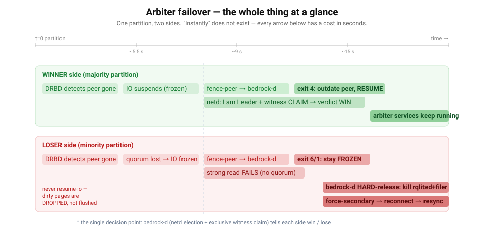

# Arbiter failover — explainers

These are **one-time, read-it-once explainers** for how Bedrock's cluster **arbiter** (the
single `cluster` DRBD resource that carries `rqlited-arbiter` + `weed-filer`, the `.254`
cluster VIP and the mgmt-master role) survives a node loss or a network partition.

They exist because the mechanism is subtle: a quorum-lost DRBD Primary must **freeze**, a single
authority must **decide** which side wins, the loser's services must be **killed (never cleanly
stopped)**, and all of it must happen inside a tight, well-understood time budget. The recurring
theme — and the reason these docs are so timing-obsessed — is that **"instantly" does not exist in
a distributed system.** Every detection, every round-trip, every consensus step costs real
wall-clock seconds, and the design is only correct if those costs are bounded and non-overlapping.

## The perspectives

| Doc | Perspective | Answers |
|-----|-------------|---------|
| [01 — DRBD's view](01-drbd-perspective.md) | The kernel DRBD driver, **once on each side** | When does DRBD *notice* the peer is gone? Why does it freeze instead of keep writing? What does the fence-peer exit code do? Why does the loser's UUID never change? |
| [02 — bedrock-d's view](02-bedrock-perspective.md) | The Python daemon **making the call** | How does bedrock-d turn "a peer vanished" into a win/lose verdict? How does the *exclusive witness claim* make an even split safe? How are `rqlited-arbiter` and `weed-filer` **killed** on the loser and **started** on the winner? When does `.254` move? |
| [03 — timing & races](03-timing-and-races.md) | The clock, **across all layers** | Best case vs worst case, second by second. Can two nodes both be Primary? Can a stale verdict win? Can the witness be double-claimed? Where are the *known* residual races, and why are they bounded? |
| [04 — network & election](04-network-and-election.md) | **netd mesh + election HB** | What packets fly, how often, to whom? Master polling or symmetric hellos? How do mesh, witness, DRBD, and fence-peer line up on one timeline? Why isn't rqlite `strong` read involved in arbiter fence? |

## One-paragraph mental model

A partition splits the cluster. **DRBD on every affected node freezes its I/O** — the majority
side because its fence handler hasn't said "go" yet, the minority side because it has lost DRBD
quorum. Frozen means *no writes on either side*, which is what prevents split-brain. DRBD then runs
a **synchronous fence-peer callout** that asks the local `bedrock-d` "do I win?". `bedrock-d` feeds
DRBD's fast peer-loss evidence into the netd election (collapsing its normal 10 s patience),
converges on the real partition, and — if the split is even — **exclusively claims the witness
vote** so only one side can call itself Leader. It returns **win** (exit 4 → outdate the peer →
resume) or **lose / undecided** (exit 6 / 1 → stay frozen). The frozen loser cannot be cleanly
stopped (its disk I/O is suspended), so bedrock-d **hard-releases** it: SIGKILL the arbiter
services (their dirty pages are *dropped*, never flushed → the minority still never writes),
`umount -l`, `drbdsetup secondary --force`. The winner already has the data, the services and the
`.254` VIP, so the control plane never actually went anywhere.

> Source of truth for every number in these docs:
> `installer/lib/netd.py`, `installer/lib/fence_verdict.py`, `installer/lib/cluster_arbiter.py`,
> `installer/lib/witness.py`, `installer/lib/tier_storage.py`. Constants are quoted inline so you
> can grep them.
