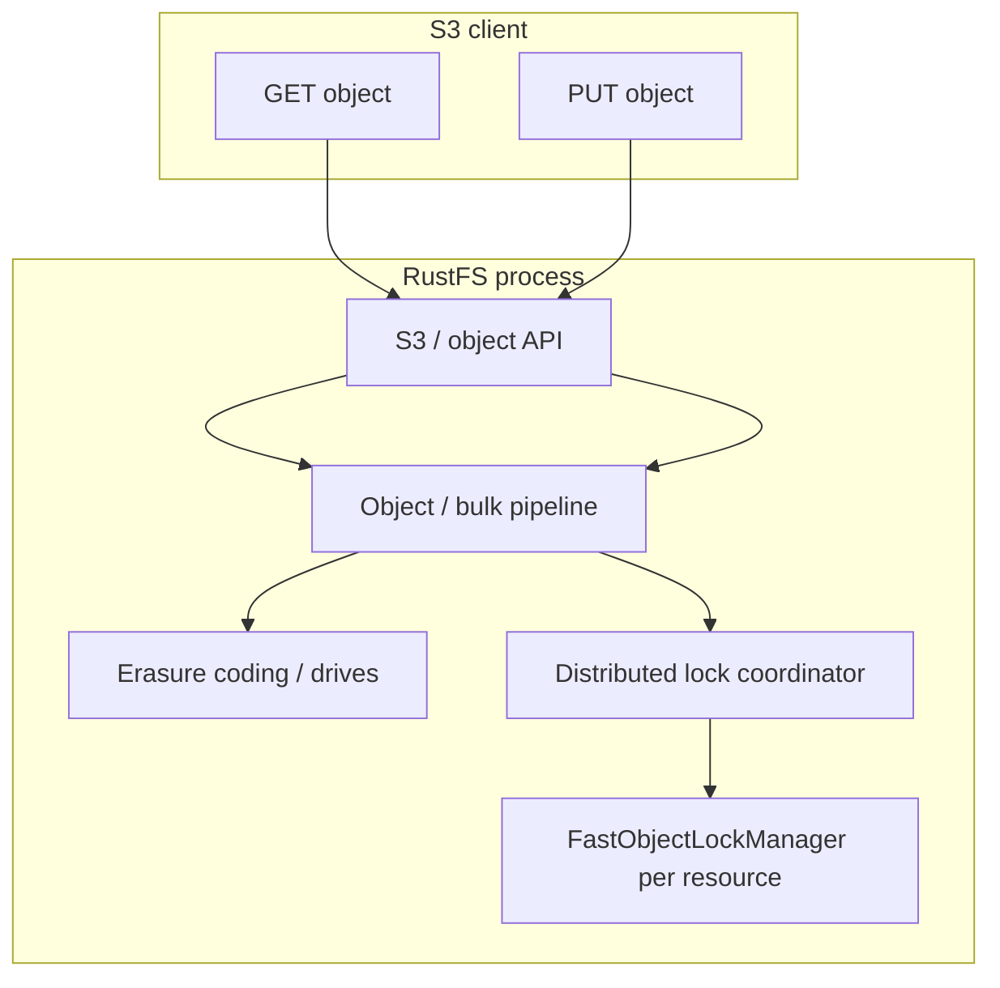

# RustFS: the `WRITERS_WAITING` cancellation leak (distributed lock context)

This document explains **what goes wrong**, **where in the architecture it lives**, and **why the Bedrock reproducer looks the way it does**. It is meant to stand alone for readers who want the full picture of the bug in RustFS as a **distributed** object store.

For the original incident write-up (including the abandoned read-quorum relaxation and validation tables), see [`rustfs-shared-lock-leak-2026-04-27.md`](./rustfs-shared-lock-leak-2026-04-27.md).

---

## 1. What you observe when the bug fires

After a **node dies or is killed while lock-related work is in flight**, reads on **some object keys** can start failing with timeouts or “quorum not reached” style errors—even though:

- Other keys on the **same** buckets and endpoints still read fine.
- The cluster may still satisfy **erasure-code** read thresholds for data on disk.
- The failure can appear on **surviving** nodes, including for **local** lock acquisition (not “only when we talk to the dead peer”).

The Bedrock reproducer’s **strict** signature (see `installer/lib/rustfs-patches/reproduce-leak.sh`) is:

- **HOT keys**: same-key **write contention** followed by a **hard kill** of the node that originated the burst; subsequent reads on those keys fail on survivors.
- **COLD keys**: keys that only saw normal population traffic—**control group**—continue to read successfully through the same endpoints.

That pattern isolates the failure to **per-object lock state** that was stressed by contention, not to generic “cluster is down” breakage.

---

## 2. Where this sits in the RustFS architecture

RustFS stacks several concerns. The bug is **not** “EC lost a fragment” by itself; it is primarily a **concurrency / ordering** bug in the **local** fast lock, which is exercised heavily by the **distributed** lock layer.

Rough layering (conceptual):

- **Erasure coding (EC)** decides how many drive reads are needed to reconstruct an object and enforces **data** quorum. That is a separate contract from lock quorum.
- **Distributed sync (“dsync”)** implements **namespace / object locks** across the set of lock peers (typically aligned with cluster topology). A logical “shared lock on `bulk/foo.bin`” is acquired in coordination across nodes so writers and readers see a consistent **serialization** story.
- **`FastObjectLockManager`** (crate `rustfs-lock`, `fast_lock`) is the **per-node, per-resource** implementation: a compact atomic bitmask plus wait queues for **shared vs exclusive** lock modes on one machine.

The leak lives in **FastObjectLockManager’s slow path for exclusive waiters**. Distributed lock RPCs ultimately **drive** that local state on each peer. When a peer vanishes, work is **cancelled**; cancellation interacts badly with the way the slow path balances `inc_writers_waiting` / `dec_writers_waiting`.

---

## 3. Local fast lock: what the bits mean

On each node, for a given locked resource (conceptually “this object’s lock record”), `AtomicLockState` packs flags into one atomic word, including at least:

- **`WRITER_FLAG_MASK`**: an **exclusive** lock is **actually held** right now.
- **`WRITERS_WAITING_MASK`**: a counter / flag slice meaning **some exclusive acquirer is in the slow-path queue** waiting for readers to drain or for the lock to become free.

**Shared locks** (many concurrent readers) are supposed to be compatible with each other. **Exclusive locks** (writers) require a clean window: no readers, no other writer.

Upstream’s **shared-lock fast path** historically treated “writers waiting” like “danger—do not fast-path”:

- If **`WRITER_FLAG_MASK`** *or* **`WRITERS_WAITING_MASK`** is observed, the fast path bails and the acquirer goes to the slow path and may **wait** (with a timeout).

That is reasonable **if** `WRITERS_WAITING_MASK` always tells the truth.

---

## 4. The slow-path exclusive waiter: where the bit leaks

Exclusive acquisition under contention uses a slow path similar in spirit to:

1. Increment **`WRITERS_WAITING`** — “I am an exclusive waiter.”
2. `await` a notification / future that fires when the lock becomes available.
3. On success, timeout, or error return path: decrement **`WRITERS_WAITING`** — “I am no longer waiting.”

The bug is classic **cancellation safety**:

- If the task awaiting step 2 is **dropped or aborted** before execution reaches step 3, **step 3 never runs**.
- The atomic word still advertises “writers waiting” even though **no real waiter** remains.

**Why cancellation shows up in a distributed system:** when a peer dies, RPCs fail, higher-level futures unwind, `JoinSet`s abort work, and lock orchestration tears down in-flight operations. Any exclusive-lock attempt that had already executed **`inc_writers_waiting()`** on a surviving peer can disappear without **`dec_writers_waiting()`**.

So the failure mode is:

> **A phantom writer-waiter** — a bit stuck high — **blocks shared-lock fast path** on that resource until something clears it (cleanup timers, restart, etc.).

Readers then pile into the slow path and hit **acquire timeouts** (Bedrock observed ~5s windows in traces), which surfaces as “can’t read this key” even when the data could be read if ordering allowed it.

---

## 5. How the distributed layer makes this visible

The dsync layer (`distributed_lock.rs` in the lock crate) negotiates lock mode across **N lock clients**. It has its own **quorum** rules for whether a distributed shared or exclusive lock call succeeds.

Important distinction:

1. **Distributed read quorum** might still be satisfiable if enough peers respond “OK” for a shared lock.
2. But if **each** peer’s local `FastObjectLockManager` refuses the fast path due to a **stale** `WRITERS_WAITING` on that object, you can still end up with **timeouts** on survivors—including the local node—because the local primitive never grants the lock promptly.

That is why debugging logs showed **both surviving lock clients** timing out: not because dsync’s arithmetic was impossible, but because **local lock state was wedged** on the relevant resources.

Smaller clusters (e.g. 3 nodes) amplify visibility: losing one peer is a large fraction of the system, and there is less slack for “some other path will clear state.” The bug is **not inherently 3-node-only**; larger clusters simply hit the stale-bit scenario less often or recover faster.

---

## 6. Why the reproducer stresses **same-key** writes, large payloads, then **kill**

`reproduce-leak.sh` is tuned to maximize the chance that **multiple exclusive acquirers** hit the **slow path** on the same small set of keys:

- **Many writers per hot key** → real contention on the exclusive lock path for those resources.
- **Large payloads** → longer exclusive hold windows and wider timing windows for in-flight waiters.
- **Kill the victim** shortly after burst start → cancellation / teardown while peers still have waiters associated with those keys.

Keys that never entered that regime (the **cold** control set) keep working, which is strong evidence the problem is **stuck local lock flags on contended resources**, not “S3 is broken globally.”

---

## 7. Data safety vs lock safety (why we rejected the wrong “fix”)

It is tempting, on small N, to relax **distributed read quorum** so reads tolerate one missing lock peer. That can **mask** the symptom.

It is **unsafe** as a substitute for fixing lock state: dsync correctness relies on overlap between write-quorum sets and read-quorum sets so a reader cannot slip past an in-flight writer on a disjoint partition of nodes. Bedrock documented this in detail in [`rustfs-shared-lock-leak-2026-04-27.md`](./rustfs-shared-lock-leak-2026-04-27.md) (see the `Wq + Rq > N` argument).

The durable fix direction is:

- **Proper:** make the slow-path waiter **always** pair `dec_writers_waiting()` with `inc_writers_waiting()` under cancellation (e.g. `Drop` guard, scoped RAII, or restructuring the async state machine).
- **Bedrock workaround (patch 0002):** allow **shared** fast path to ignore **stale** `WRITERS_WAITING` and only block on an **actual exclusive holder** (`WRITER_FLAG_MASK`). Exclusive acquisition remains strict (still requires a fully drained lock).

The workaround trades **writer fairness** (readers can starve a queued writer on a hot object) for **read liveness** under peer failure—acceptable for Bedrock’s mostly-read tier until upstream lands a cancellation-safe slow path.

---

## 8. References in this repository

| Artifact | Role |
|----------|------|
| [`installer/lib/rustfs-patches/reproduce-leak.sh`](../../installer/lib/rustfs-patches/reproduce-leak.sh) | End-to-end cluster reproducer; documents the original shard location in comments. |
| [`installer/lib/rustfs-patches/0002-shared-lock-bypass-stale-writers-waiting.patch`](../../installer/lib/rustfs-patches/0002-shared-lock-bypass-stale-writers-waiting.patch) | The shared fast-path workaround; commit message mirrors this analysis. |
| [`installer/lib/rustfs-patches/README.md`](../../installer/lib/rustfs-patches/README.md) | Patch list, build instructions, high-level rationale. |
| [`rustfs-shared-lock-leak-2026-04-27.md`](./rustfs-shared-lock-leak-2026-04-27.md) | Incident log, empirical matrix, and why the read-quorum patch was dropped. |

---

## 9. Glossary

| Term | Meaning here |
|------|----------------|
| **dsync** | Distributed lock coordination across RustFS lock clients / peers. |
| **Fast lock** | Per-node `FastObjectLockManager` / `AtomicLockState` fast/slow paths. |
| **`WRITERS_WAITING`** | Flag/counter slice in atomic lock state for “exclusive waiter queued.” |
| **Cancellation** | Async task dropped before completing its paired decrement—source of the leak. |
| **Strict repro** | Hot reads fail, cold reads succeed—points to per-key contention + stuck state. |

---

*Last updated: 2026-05-03 — written as a conceptual companion to the 2026-04-27 scenario note.*
